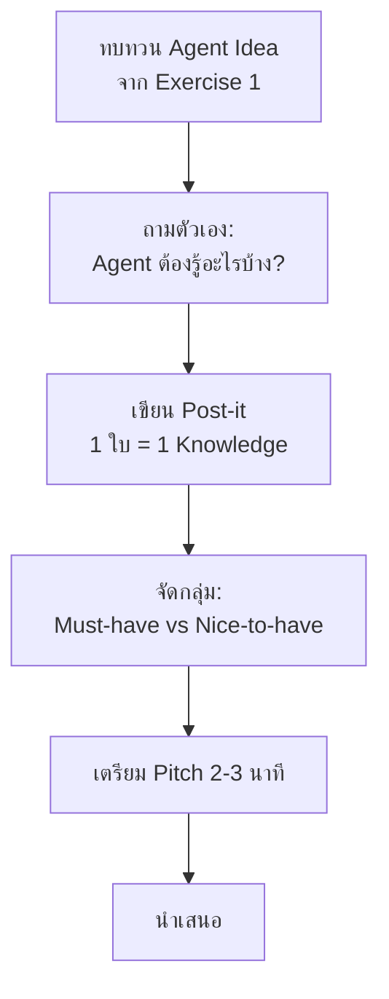
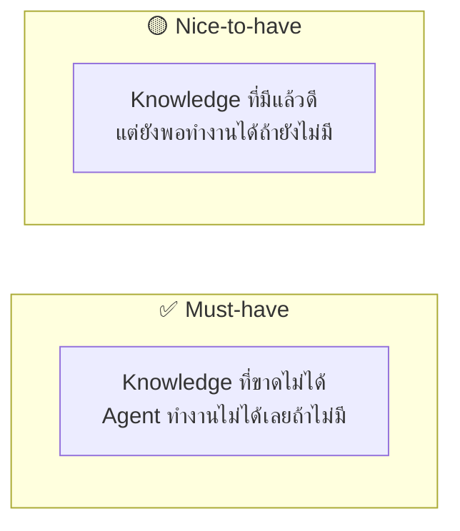

# Module 1 / Exercise 2: Knowledge Mapping — ระบุความรู้ที่ Agent ต้องการ

Objective: วิเคราะห์ไอเดีย AI agent ของพวกเราและระบุ knowledge sources ที่จำเป็น   

---

## Goal

ในแบบฝึกหัดนี้ พวกเราจะได้ฝึกวิเคราะห์ไอเดีย AI agent ที่พวกเราเลือกจาก Exercise 1 (หรือของพวกเราเอง) และระบุข้อมูลที่จำเป็น สำหรับให้ Agent ทำงานได้จริงในบริบทธุรกิจของ SET
## ขั้นตอนการทำ Workshop

กระบวนการทำแบบฝึกหัดนี้มีดังนี้:



---

## Practice 1: ทบทวน Agent Idea

1. นึกถึงไอเดีย AI agent ที่พวกเราเลือกจาก Exercise 1 (Agents of Change) หรือไอเดียของพวกเราเองก็ได้ ถ้ายังไม่มีไอเดียที่ชัดเจน ให้ใช้เวลาสั้นๆ คิดและระดมความคิดกับเพื่อนร่วมทีมเพื่อกำหนดไอเดียคร่าวๆ ขึ้นมา
2. เขียนสรุปสั้นๆ บน Post-it หรือกระดาษ โดยระบุ:
   - Agent ชื่ออะไร หรือทำหน้าที่อะไร?
   - ใครใช้งาน Agent นี้?
   - Agent ช่วยแก้ปัญหาอะไร?

> **💡 Tip:** ถ้ายังนึกไม่ออก ลองนึกถึงคำถามที่เพื่อนร่วมทีมถามบ่อยๆ ในชีวิตการทำงาน

---

## Practice 2: ระดมไอเดีย Knowledge ด้วย Post-it

ให้ถามตัวเองว่า: **"Agent ต้องรู้อะไรบ้าง เพื่อให้ตอบคำถามหรือทำงานนี้ได้?"**

เขียน Post-it **1 ใบต่อ 1 knowledge** โดยระบุข้อมูลดังนี้:

```
┌─────────────────────────────────────────┐
│  ชื่อ Knowledge:                         │
│  [เช่น ราคาหลักทรัพย์รายวัน]            │
│                                         │
│  รูปแบบข้อมูลจริง:                       │
│  [เช่น CSV, PDF, Excel, Database, API]  │
│                                         │
│  ตัวอย่างข้อมูลในโลกจริง:               │
│  [เช่น ไฟล์ Market Data จาก SET        │
│   อัปเดตทุกวันหลังตลาดปิด]             │
│                                         │
│  มาจากแหล่งไหน:                         │
│  [เช่น SET Market Data Portal,          │
│   SharePoint ทีม, ระบบ HR]              │
└─────────────────────────────────────────┘
```

### ตัวอย่าง Knowledge 

| Knowledge | รูปแบบข้อมูล | ตัวอย่างข้อมูลจริง |
|---|---|---|
| ราคาและปริมาณซื้อขายหลักทรัพย์ | CSV / API | ไฟล์ end-of-day จาก Market Data |
| Compliance และ Regulation | PDF / Word | ประกาศ ก.ล.ต. |
| นโยบายภายในองค์กร | PDF / SharePoint | คู่มือพนักงาน, ระเบียบการเบิกจ่าย |
| ข้อมูลบริษัทจดทะเบียน | Database / Excel | ข้อมูลผู้ออกหลักทรัพย์, งบการเงิน |
| ปฏิทินกิจกรรม | Excel / Calendar | วันหยุด, วันประชุมผู้ถือหุ้น (AGM) |

> **💡 Tip:** ยิ่งระบุรูปแบบข้อมูลได้ชัด ยิ่งช่วยได้มากเวลา build จริง เพราะ Copilot Studio รองรับ Knowledge source ต่างกันตามรูปแบบ เช่น SharePoint, PDF Upload, Public Website

---

## Practice 3: จัดกลุ่ม Post-it

นำ Post-its ทั้งหมดมาเรียงบนโต๊ะหรือ whiteboard แล้วแบ่งออกเป็น 2 กลุ่ม:



> **⚠️ Note:** อย่าพยายามใส่ knowledge ทุกอย่างตั้งแต่แรก การเริ่มจาก Must-have ก่อนจะช่วยให้ Agent ที่ build ออกมาทำงานได้จริงเร็วขึ้น

---

## Practice 4: เตรียม Pitch 

เตรียมนำเสนอสั้นๆ **2-3 นาที** ต่อ trainer และเพื่อนร่วม bootcamp

ใช้ checklist ด้านล่างตรวจความพร้อม:

- [ ] **ชื่อและหน้าที่ของ Agent** — อธิบายได้ใน 1 ประโยค
- [ ] **Must-have Knowledge อย่างน้อย 3 รายการ** — พร้อมบอกรูปแบบและแหล่งที่มา
- [ ] **เหตุผล** — สามารถอธิบายได้ว่าทำไม Agent ถึงต้องการ knowledge แต่ละชิ้น
- [ ] **ข้อมูลในโลกจริง** — ยกตัวอย่างได้ว่าข้อมูลหน้าตาเป็นอย่างไร

### ตัวอย่างการ Pitch

```
Agent ของเราชื่อ "Compliance Q&A Bot" ทำหน้าที่ตอบคำถามเกี่ยวกับ
ข้อกำหนดของ ก.ล.ต. และ SET ให้กับทีม Operations

Must-have Knowledge มี 3 ชิ้น:
1. ประกาศและวงเวียน ก.ล.ต. — รูปแบบ PDF — มาจาก เว็บไซต์ ก.ล.ต. สาธารณะ
2. Rulebook ของ SET — รูปแบบ PDF — เก็บอยู่ใน SharePoint ของทีม Legal
3. FAQ Compliance ภายใน — รูปแบบ Word/Excel — อัปเดตโดยทีม Compliance ทุกไตรมาส

เหตุผลที่ต้องการ Knowledge เหล่านี้ คือ คำถาม Compliance ส่วนใหญ่อ้างอิง
ข้อความในเอกสารโดยตรง Agent ที่ตอบได้แม่นต้องอ่านเอกสารเดิมได้
```

---

## Summary

พวกเราได้ฝึก:
- **วิเคราะห์** ความต้องการ knowledge ของ AI agent idea ก่อน build จริง
- **ระบุ** รูปแบบและแหล่งที่มาของข้อมูลในโลกจริง
- **จัดลำดับ** ความสำคัญของ knowledge ด้วยแนวคิด Must-have vs Nice-to-have
- **สื่อสาร** เหตุผลและ data context ต่อ committee อย่างมั่นใจ

ขั้นตอนถัดไป: ใน Module 3 เราจะนำ knowledge เหล่านี้มาใส่ใน Copilot Studio จริงๆ ผ่านฟีเจอร์ **Knowledge** ของ Agent
