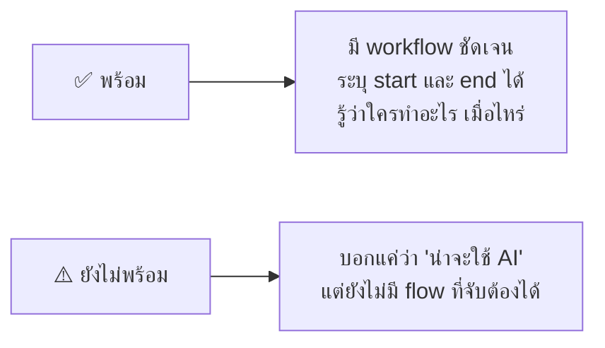
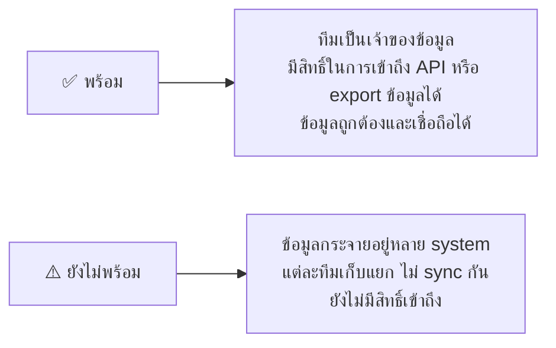
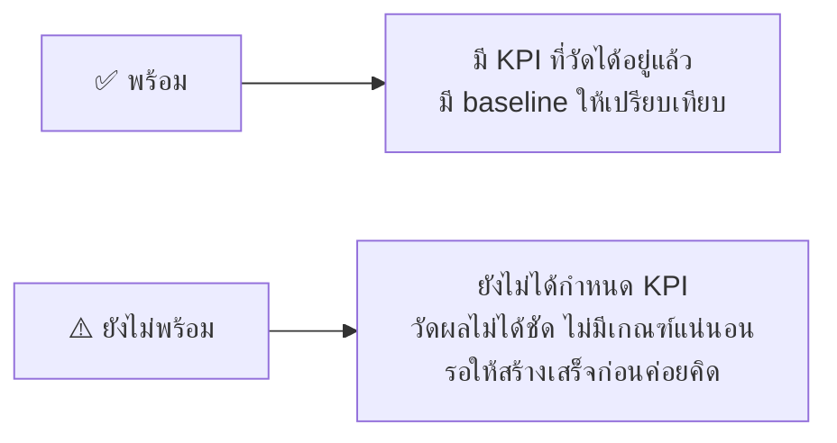
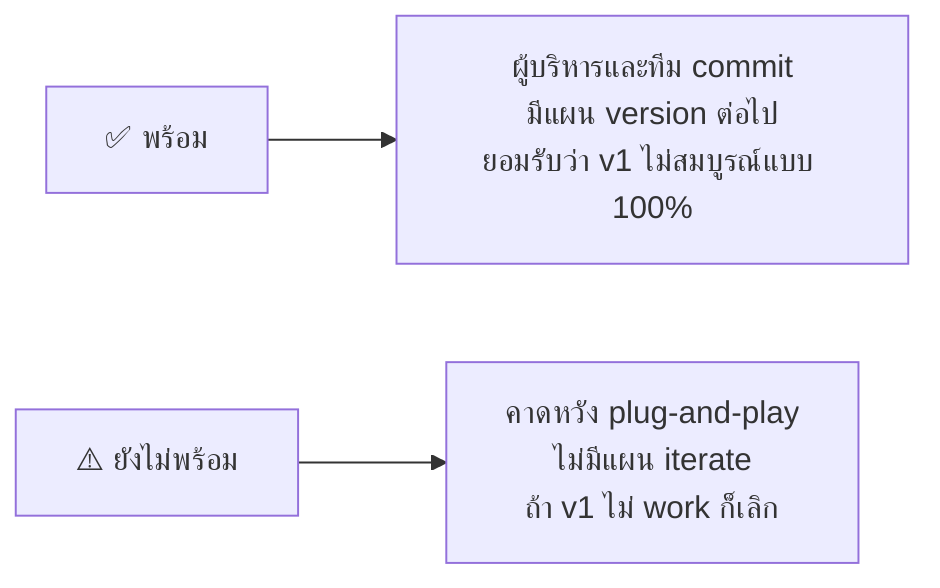

# Exercise 1: Agent Readiness Scoring

ก่อนลงมือสร้าง AI Agent ใน Copilot Studio ทีมควรประเมินความพร้อมของ project ใน 4 ส่วนหลัก
การให้คะแนนนี้ช่วยให้เห็นจุดแข็ง จุดอ่อน และสิ่งที่ต้องปรับปรุงก่อน build จริง

> **⚠️ Note:** แบบฝึกหัดนี้ไม่ต้องใช้ Copilot Studio — ใช้เพียงกระดาษ, Whiteboard หรือ Word/Notion ในการบันทึกคะแนนและ action plan ก็เพียงพอ

---

## เกณฑ์การให้คะแนน (1–5)

| คะแนน | ความหมาย |
|---|---|
| 5 | พร้อมมาก — มีทุกอย่างครบตามเกณฑ์ ✅ |
| 4 | ค่อนข้างพร้อม — ขาดเล็กน้อย ปรับได้ไว |
| 3 | พอไปได้ — มีบางส่วน แต่ต้องลงทุนเพิ่ม |
| 2 | ยังไม่พร้อม — มีปัญหาหลักที่ต้องแก้ก่อน |
| 1 | ยังไม่ชัดเจน — อยู่ในสถานะ ⚠️ ยังไม่ควรเริ่มทำ |

---

## Practice 1: Workflow

### Workflow คืออะไร?

Metric นี้ดูว่า AI Agent ที่คุณจะสร้างมีกระบวนการทำงาน (business process) ที่ชัดเจนหรือไม่



**ตัวอย่าง ✅ พร้อม:**
- Agent รับคำถามจากพนักงาน HR → ค้นหาในฐานข้อมูล Policy → ตอบกลับพร้อม link เอกสาร
- มีขั้นตอนชัดเจน: รับ input → ประมวลผล → ส่ง output

**ตัวอย่าง ⚠️ ยังไม่พร้อม:**
- "อยากให้ AI ช่วยเรื่อง HR" (ยังไม่ระบุว่าช่วยอะไร เริ่มต้นยังไง จบตรงไหน)

### ให้คะแนน Project ของทีม

กรอกข้อมูลต่อไปนี้สำหรับ AI Agent project ของทีม:

```
Metric: Workflow

คะแนนของทีม: _____ / 5

สิ่งที่ขาดหรือต้องปรับปรุง:
- 
- 

วิธีปรับปรุง:
- 
- 
```

---

## Practice 2: Data Availability

### Data Availability คืออะไร?

Metric นี้ดูว่าทีมมีข้อมูล (data) ที่ Agent ต้องการใช้จริงหรือไม่ และเข้าถึงได้หรือเปล่า



**ตัวอย่าง ✅ พร้อม:**
- ข้อมูล Policy อยู่ใน SharePoint ที่ทีมดูแลเอง และ export เป็น PDF ได้
- มี API ที่เชื่อมกับ database หลัก และได้รับสิทธิ์แล้ว

**ตัวอย่าง ⚠️ ยังไม่พร้อม:**
- "ข้อมูลอยู่ใน SAP แต่ต้องขอ IT" / "บางส่วนอยู่ใน Excel ของแต่ละคน ไม่มี master"

### ให้คะแนน Project ของทีม

กรอกข้อมูลต่อไปนี้สำหรับ AI Agent project ของทีม:

```
Metric: Data Availability

คะแนนของทีม: _____ / 5

สิ่งที่ขาดหรือต้องปรับปรุง:
- 
- 

วิธีปรับปรุง:
- 
- 
```

---

## Practice 3: Measurement

### Measurement คืออะไร?

Metric นี้ดูว่าทีมรู้วิธีวัดความสำเร็จของ Agent หรือไม่ มี KPI ที่ชัดเจนก่อน build หรือเปล่า



**ตัวอย่าง ✅ พร้อม:**
- ปัจจุบัน HR ใช้เวลาตอบคำถาม Policy เฉลี่ย 30 นาที → ต้องการให้ Agent ลดเหลือไม่เกิน 5 นาที
- ปัจจุบัน ticket escalation 40% → ตั้งเป้าให้ Agent ลดเหลือ 20%

**ตัวอย่าง ⚠️ ยังไม่พร้อม:**
- "อยากให้ดีขึ้น" / "ประหยัดเวลา" (ไม่มีตัวเลข ไม่มี baseline)

### ให้คะแนน Project ของทีม

กรอกข้อมูลต่อไปนี้สำหรับ AI Agent project ของทีม:

```
Metric: Measurement

คะแนนของทีม: _____ / 5

สิ่งที่ขาดหรือต้องปรับปรุง:
- 
- 

วิธีปรับปรุง:
- 
- 
```

---

## Practice 4: Iteration & Development

### Iteration & Development คืออะไร?

Metric นี้ดูว่าทีมและผู้บริหารพร้อมจะ iterate และพัฒนา Agent ต่อเนื่องหรือไม่



**ตัวอย่าง ✅ พร้อม:**
- ทีมวางแผน sprint 2 สัปดาห์ สำหรับ feedback loop หลัง launch
- ผู้บริหาร approve งบสำหรับ 3 เดือนแรกของการปรับปรุง

**ตัวอย่าง ⚠️ ยังไม่พร้อม:**
- "ทำครั้งเดียวแล้วใช้งานได้เลย" / "ถ้า AI ตอบผิด ก็คงไม่ใช้"

### ให้คะแนน Project ของทีม

กรอกข้อมูลต่อไปนี้สำหรับ AI Agent project ของทีม:

```
Metric: Iteration & Development

คะแนนของทีม: _____ / 5

สิ่งที่ขาดหรือต้องปรับปรุง:
- 
- 

วิธีปรับปรุง:
- 
- 
```

---

## Summary: สรุปคะแนนและเตรียม Present

เมื่อให้คะแนนครบทั้ง 4 Metric แล้ว ให้สรุปเป็นตาราง:

```
ชื่อทีม / ชื่อ Agent Project: _________________________

| Metric                  | คะแนน (1–5) | สิ่งที่ต้องปรับปรุงหลัก         |
|-------------------------|-------------|----------------------------------|
| Workflow                | ___         |                                  |
| Data Availability       | ___         |                                  |
| Measurement             | ___         |                                  |
| Iteration & Development | ___         |                                  |
| รวม                     | ___ / 20    |                                  |
```

### เตรียมนำเสนอ (3–5 นาทีต่อทีม)

เตรียมตอบคำถามต่อไปนี้เมื่อ present:

1. **Agent ของทีมทำอะไร?** — อธิบาย use case ใน 1–2 ประโยค
2. **Metric ที่แข็งแกร่งที่สุด** — คะแนนสูงสุดคือ Metric ไหน และทำไม?
3. **Metric ที่ต้องปรับปรุงที่สุด** — คะแนนต่ำสุดคืออะไร และแผนคืออะไร?
4. **Next action** — ทีมจะทำอะไรต่อไปหลังจาก module นี้?

> **💡 Tip:** คะแนนรวม 16–20 = พร้อม build ได้เลย / 11–15 = ควรแก้ช่องโหว่ก่อน / ต่ำกว่า 10 = ควร reframe use case ก่อน

---

## Summary

คุณได้ประเมิน AI Agent project ของทีมใน 4 มิติ: Workflow, Data Availability, Measurement และ Iteration & Development
ผลลัพธ์นี้จะช่วยให้การออกแบบ Canvas ใน exercise ถัดไปมีทิศทางที่ชัดเจนและสอดคล้องกับความเป็นจริง

**Next Step:** ไปต่อที่ [AI Agent Canvas Template](../ai-agent-canvas-template-links.md) เพื่อเริ่มออกแบบ Agent อย่างเป็นระบบ
