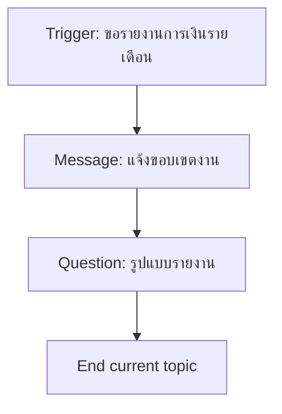
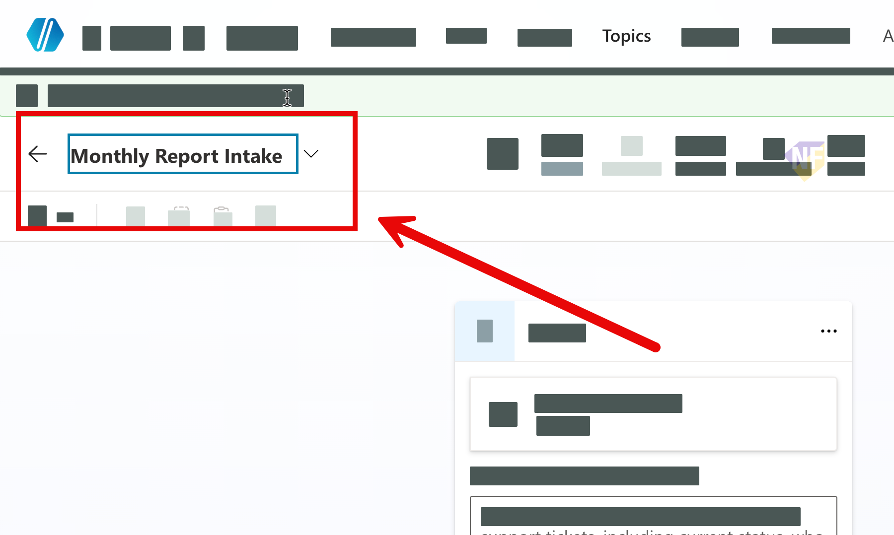
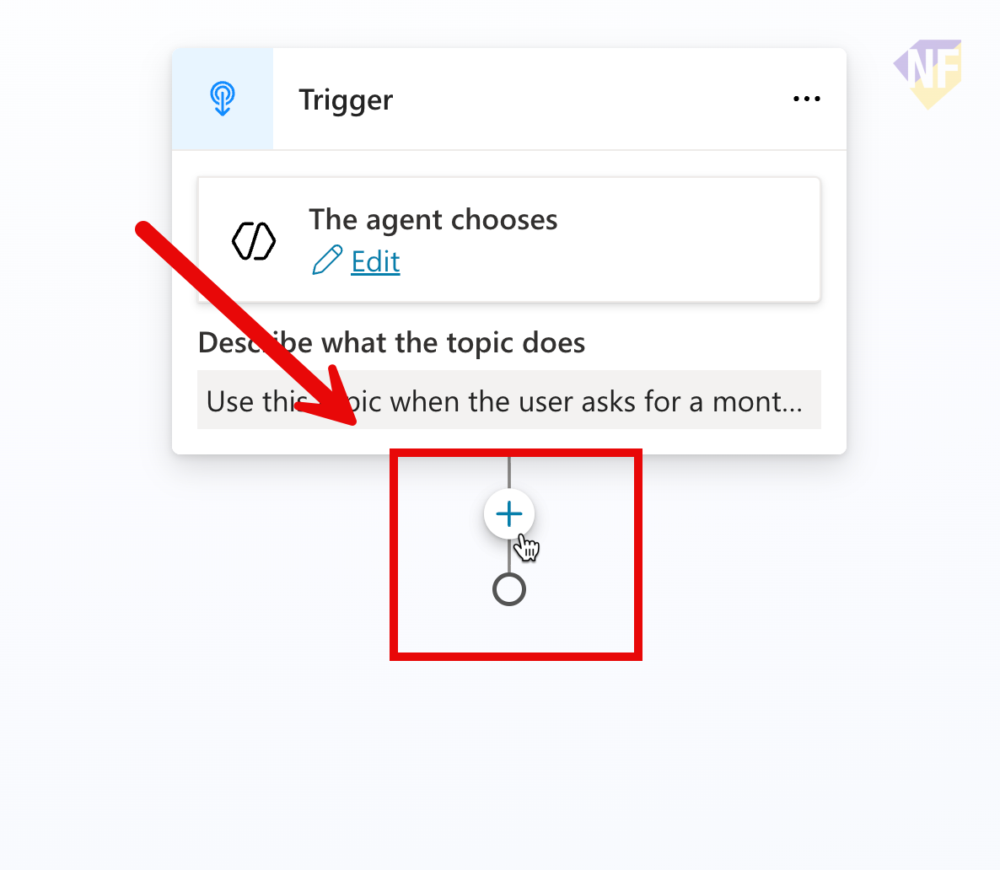
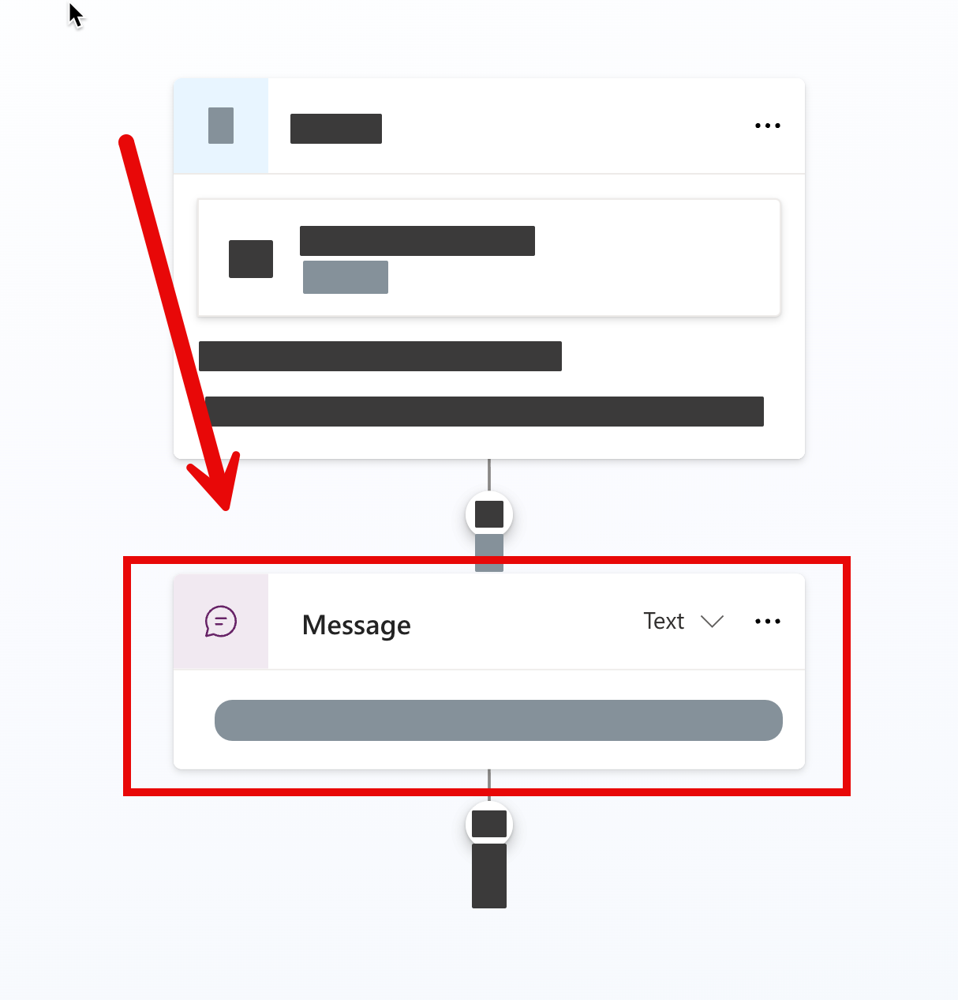
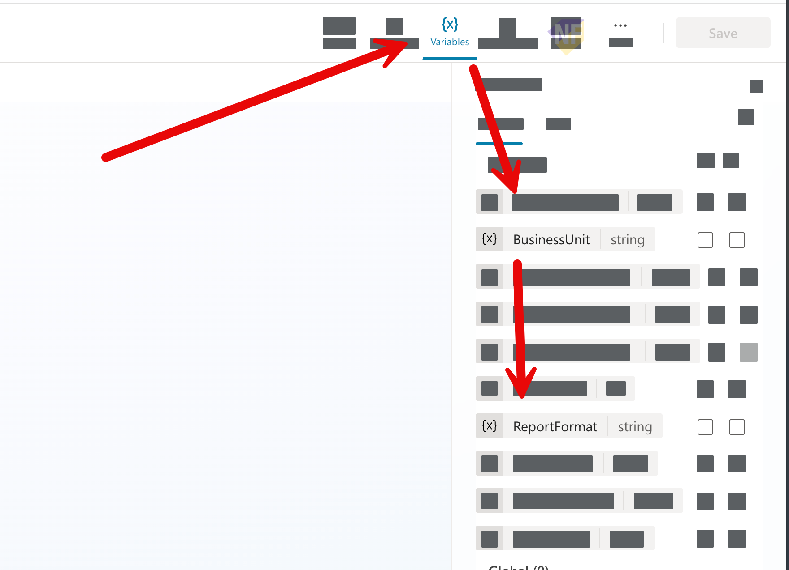
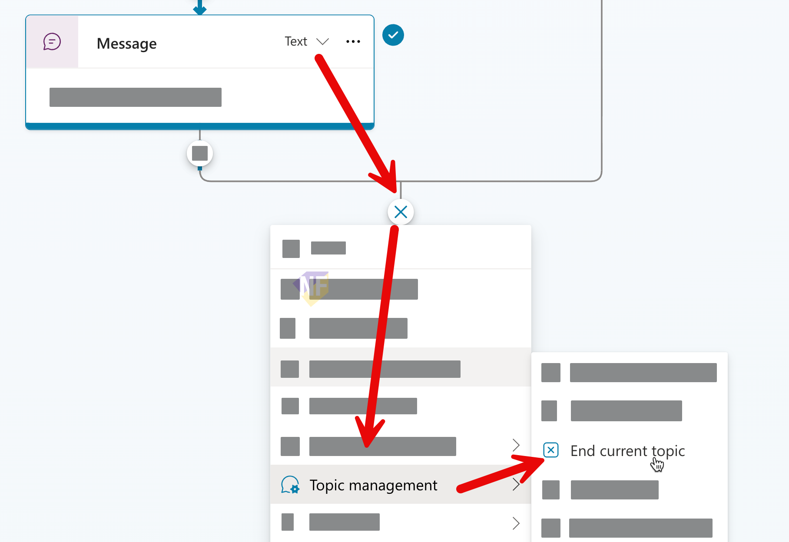

# แบบฝึกหัดที่ 2: ออกแบบ Topic รับความต้องการรายงานการเงิน

🔑 **ต้องการ M365 Copilot License + สิทธิ์เข้าใช้ Copilot Studio**

แบบฝึกหัดนี้จะพาเราสร้าง Topic แรกของ **Financial Monthly Report Agent** เพื่อรับข้อมูลจากผู้ใช้ให้ครบก่อนเริ่มวิเคราะห์ โดยในเวอร์ชันนี้เราจะเก็บแค่ 1 ค่า คือ **Report Format** เพื่อให้ flow เรียบง่ายและทำตามได้ง่ายขึ้น



---

## Practice 1: สร้าง Topic และตั้ง Description สำหรับ Trigger

1. เข้า [https://copilotstudio.microsoft.com](https://copilotstudio.microsoft.com) แล้วเปิด Agent ของคุณ
2. ไปที่ **Topics** และกด **Add a topic** เลือก **Blank Topic**
   
3. ด้านบนขวา ให้คลิกตั้งชื่อ Topic ว่า `Monthly Report Intake`
   
4. ลงมาที่ Trigger node และใส่ Description prompt เพื่อช่วยให้ Agent เลือก Topic นี้ได้แม่นขึ้น เช่น:

   ```
   Use this topic when the user asks for a monthly financial report or financial summary.
   The user may provide incomplete details, such as a missing preferred report format.
   Typical requests include: "Please summarize the monthly financial report", "I need a monthly financial summary", "Can you provide a KPI summary format?"
   ```
5. กดปุ่ม **Save** ด้านบนขวาเพื่อบันทึกการเปลี่ยนแปลงทั้งหมด
6. ทดสอบ prompt

   ```
   ช่วยเตรียมสรุปรายงานการเงินรายเดือน
   ```
7. ตรวจสอบว่า Agent มีการเลือก Topic นี้หรือไม่

> 💡 **Tip:** ใน Description ให้ระบุเจตนาของผู้ใช้อย่างชัดเจน ระบุข้อมูลที่มักยังขาด เช่น รูปแบบรายงาน และใส่ตัวอย่างคำขอ 2-3 แบบ เพื่อช่วยให้ Agent เลือก Topic นี้ได้แม่นยำขึ้น

---

## Practice 2: ส่งข้อความแจ้งขอบเขตงานด้วย Message node

1. ด้านล่าง Trigger node ให้คลิกปุ่ม **+** แล้วเลือก **Send a message** node
   
2. เพิ่ม **Message** node เพื่อบอกผู้ใช้ว่า Agent จะเก็บข้อมูลก่อนสร้างรายงาน
3. คลิกที่ชื่อด้านบนของ Message node แล้วตั้งชื่อว่า

   ```
   Inform about data collection
   ```
4. ในช่อง Message ให้ใส่ข้อความด้านล่างเพื่อแจ้งผู้ใช้

   ```
   ก่อนที่ฉันจะช่วยสรุปรายงานการเงินได้ ฉันขอเก็บข้อมูลเพิ่มเติมนิดหน่อยนะคะ
   ```
   

---

## Practice 3: เพิ่มคำถามเรื่องรูปแบบรายงาน

1. จากด้านล่างของ Message node ให้กด **+** แล้วเลือก **Ask a question** node
2. คลิกที่ชื่อด้านบนของ Question node แล้วตั้งชื่อว่า

   ```
   Ask for report format
   ```
3. ใช้ข้อความด้านล่างสำหรับช่อง Message

   ```
   ต้องการให้สรุปผลลัพธ์ในรูปแบบใดคะ เช่น Executive summary, KPI summary หรือ Detailed
   ```
4. ให้เลือกประเภทการเก็บข้อมูลเป็น **User's entire response**
5. บันทึกคำตอบไว้ในตัวแปร โดยคลิกเลือก Save User's response as แล้วกรอกชื่อ `ReportFormat` ลงไปในช่อง Variable name
6. กดปุ่ม **Save** ด้านบนขวาเพื่อบันทึกการเปลี่ยนแปลงทั้งหมด

---

## Practice 4: ตรวจสอบตัวแปรที่เก็บได้

1. คลิกที่ variable ด้านบนขวา แล้วตรวจสอบว่าตอนนี้มีตัวแปรหลักคือ:
   - `ReportFormat`
   > จากภาพตัวอย่างให้สังเกตแค่ตัวแปร ReportFormat ก็พอนะครับ
  
2. กดปุ่ม **Save** ด้านบนขวาเพื่อบันทึกการเปลี่ยนแปลงทั้งหมด

---

## Practice 5: End current topic หลังจากยืนยันข้อมูลครบถ้วน

1. จาก Message node ที่ยืนยันข้อมูลครบถ้วน ให้กด **+** แล้วเลือก **Topic management** > **End current topic**
   
2. กดปุ่ม **Save** ด้านบนขวาเพื่อบันทึกการเปลี่ยนแปลงทั้งหมด

---

## Practice 6: ปรับ instructions ของ Agent ให้เรียกใช้งาน Topic เมื่อตรงตามเงื่อนไข

1. ไปที่หน้า **Overview** ของ Agent แล้วลงมาด้านล่างที่ **Instructions**
2. กดปุ่ม **Edit** เพื่อแก้ไข Instructions
3. ด้านท้ายของ Instructions ให้เพิ่มข้อความเพื่อบอก Agent ว่าเมื่อใดควรเรียกใช้ Topic นี้ เช่น:

   ```
   - If user asks for monthly report analysis, use
   ```
4. พิมพ์ `/` และเลือก Topic `Monthly Report Intake`
5. กดปุ่ม **Save** เพื่อบันทึกการเปลี่ยนแปลง

---

## Practice 7: ทดสอบ Topic รอบแรก

1. เปิดหน้าต่าง **Test** ด้านขวา
2. ทดสอบด้วยคำสั่ง:

   ```
   ช่วยทำรายงานการเงินประจำเดือนให้หน่อย
   ```

3. ตรวจสอบว่า Agent ถามข้อมูลที่ขาดครบ โดยควรถามเรื่องรูปแบบรายงาน
4. บันทึกสิ่งที่ต้องปรับ 2-3 จุด เช่น คำถามไม่ชัด หรือข้อความยืนยันยังไม่ตรงงานจริง

---

## สรุป

ในแบบฝึกหัดนี้ คุณได้สร้าง Topic intake สำหรับงานรายงานการเงิน โดยใช้ Trigger, Question, และ Variable (`ReportFormat`) ในเวอร์ชันที่เรียบง่ายขึ้น

ขั้นตอนถัดไป → [เชื่อมข้อมูล Excel และเรียก Action วิเคราะห์](../exercise-3-excel-analysis-action/README.md)
