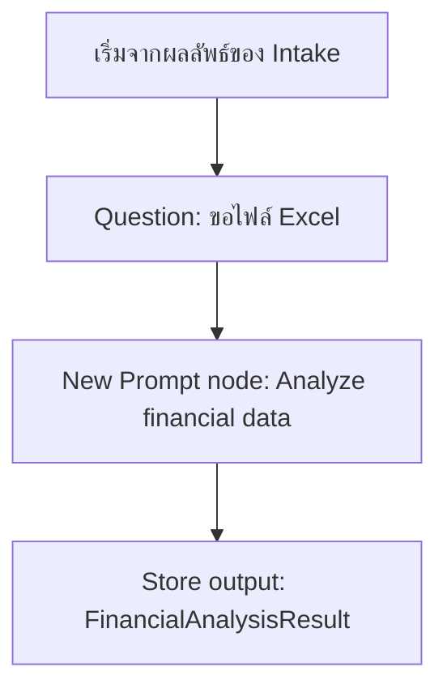
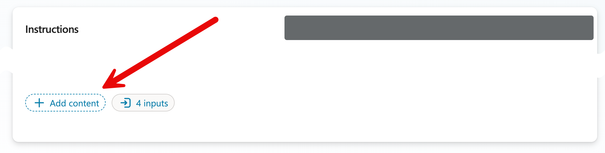
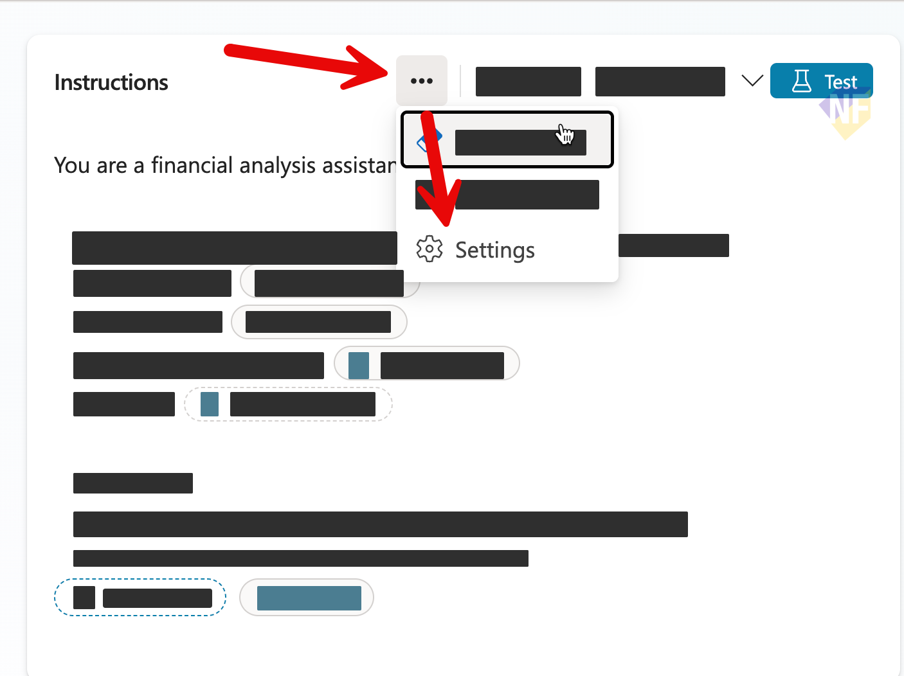
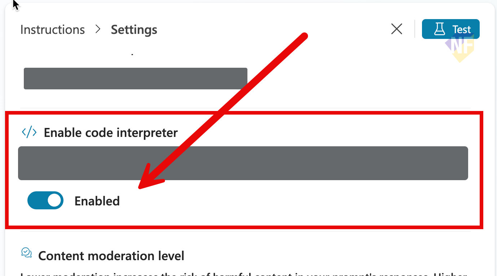
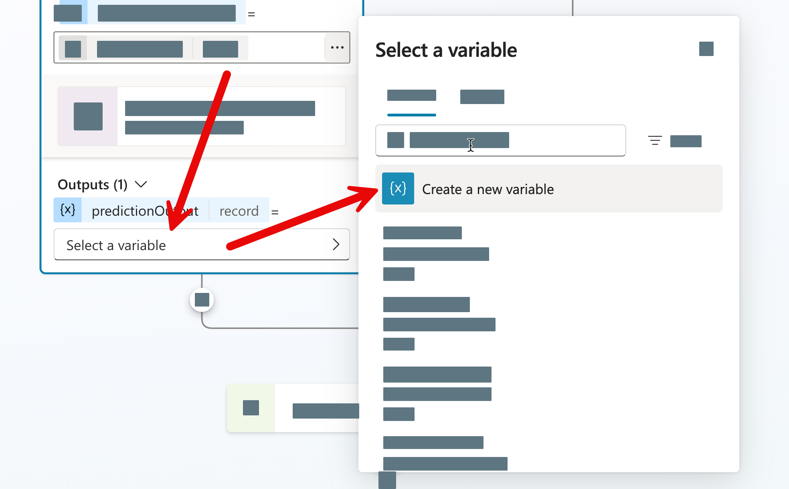

# แบบฝึกหัดที่ 3: เชื่อมข้อมูล Excel และใช้ New Prompt node วิเคราะห์

🔑 **ต้องการ M365 Copilot License + สิทธิ์เข้าใช้ Copilot Studio**

หลังจากได้ข้อมูลสำคัญจาก Topic intake แล้ว แบบฝึกหัดนี้จะให้เราเพิ่ม **New Prompt node** เข้าไปใน Topic เดิม เพื่อวิเคราะห์ข้อมูลจากไฟล์ Excel ที่ผู้ใช้อัปโหลด และเก็บผลลัพธ์ไว้ในตัวแปรสำหรับใช้ต่อในแบบฝึกหัดถัดไป

## เตรียมไฟล์ที่ใช้ในแบบฝึกหัด

1. ใช้ไฟล์ตัวอย่างจาก repository นี้:
   - [../../../files/module-2/SET-Monthly-Financial-Report-May2026.xlsx](../../../files/module-2/SET-Monthly-Financial-Report-May2026.xlsx)
2. ตรวจสอบว่าไฟล์มี 4 sheets ต่อไปนี้:
   - `Summary`
   - `Revenue`
   - `Costs`
   - `Variance_Analysis`

> ⚠️ **Note:** ถ้า environment ของคุณไม่สามารถอัปโหลด `.xlsx` ได้ ให้ทดสอบ flow โดยใช้ชื่อไฟล์สมมติและจำลอง output ด้วย **Set variable value** node แทน



---

## Practice 1: เตรียมเส้นทางรับไฟล์

1. เปิด Topic `Monthly Report Intake` ที่สร้างจากแบบฝึกหัดก่อนหน้า
2. ถ้า Topic มี node `End current topic` ต่อจากข้อความยืนยันข้อมูลอยู่แล้ว ให้ลบ node นั้นออกชั่วคราวก่อน เพื่อให้เราต่อ flow เพิ่มได้
3. จาก Message node ที่ยืนยันข้อมูลครบ ให้กดเพิ่ม **Question** node และกำหนดรายละเอียดดังนี้:

   ### Node name:
   ```
   Ask for Excel file
   ```
   ### Message:
   ```
   กรุณาอัปโหลดไฟล์ Excel ที่มีข้อมูลการเงิน
   ```
   ### Identify:
   ```
   File
   ```
   ### Variable name:
   ```
   SourceFileName
   ```

---

## Practice 2: เพิ่ม New Prompt node เพื่อวิเคราะห์ข้อมูล

1. จาก node ล่าสุด ให้กด **+** แล้วเพิ่ม **Add a tools** > **New Prompt** node
2. ตั้งชื่อ Prompt นี้ว่า

   ```
   Analyze financial data from uploaded excel file
   ```
3. เข้า Prompt editor ของ node นี้ แล้วสังเกตส่วนที่ชื่อ **Prompt assistant**
   
4. ศึกษาและใช้ prompt ด้านล่างนี้ใน Prompt assistant และกดส่ง prompt:

   ```
   Analyze monthly financial data in the uploaded file, using ReportFormat as context. Return Markdown only. Start with a short Word-ready summary, then provide KPI summary, key risk, and notes about missing data or assumptions.
   ```

5. ไม่ว่าจะได้ prompt แบบไหน หลังจาก Assistant สร้าง prompt แล้ว **ให้ใช้ prompt ด้านล่างนี้เพื่อให้เหมือนกันในการทำ exercise**

   ```text
   You are a financial analysis assistant.

   ## Analyze monthly financial information using the following context:
   - Analyze financial data from this file and its sheets: {{Topic.SourceFileName}}
   - Preferred report format: {{Topic.ReportFormat}}

   ## Instructions:
   - Follow the preferred report format when presenting insights.
   - Produce a concise, business-friendly analysis.
   - Identify key variance drivers and one key risk.
   - If data is incomplete, explicitly state assumptions.

   ## Output format rules:
   - Return Markdown only.
   - Add KPI Summary at the end with Total Revenue, Total Cost, and Variance Percent.
   - If missing, add Key Risk section with a short risk statement.
   - If needed, add Notes section to explain assumptions or missing data.
   ```

6. จากข้อความ Prompt ให้ค่อยๆ แก้ส่วนที่เป็นเครื่องหมาย `{{...}}` ให้เป็น input ที่ส่งค่าจาก Topic เข้ามาได้ โดยตั้งชื่อตามนี้
   1. `{{Topic.ReportFormat}}` → `Report format`
7. สำหรับตัวแปร `{{Topic.SourceFileName}}` ให้แก้เป็น `Financial data file` และเลือกประเภทตัวแปรเป็น **File**
   

> 💡 **Tip:** เราสามารถใช้ปุ่ม **+ Add Content** ในการกำหนดตัวแปร input ต่างๆ ได้เช่นกัน
> 

8. จากด้านบนของ Instructions ให้กดปุ่ม More options (...) แล้วเลือก **Setting**
   
9. เปิดตัวเลือก **Code Interpreter** แล้วกดปุ่ม **x** เพื่อปิดหน้าต่าง Setting
   

> ⚠️ **Note:** การเปิด Code Interpreter จะช่วยให้ prompt นี้สามารถวิเคราะห์ข้อมูลจากไฟล์ Excel ได้ แต่จะใช้เวลาในการประมวลผลนานกว่าปกติ

10. เปิดหน้าต่าง input ของ prompt แล้วใส่ค่าทดสอบ เช่น
    - Preferred report format: `Executive Summary`
   - Financial data file: อัปโหลดไฟล์ `SET-Monthly-Financial-Report-May2026.xlsx`
11. กด **Save** แล้วกด **Test** ใน Prompt editor
12. ตรวจสอบผลลัพธ์ที่ได้ว่ามีส่วนสรุป, KPI summary, Key Risk, และ Notes ครบถ้วนตาม prompt หรือไม่

> ⚠️ **Note:** ถ้าผลลัพธ์ยังไม่สมบูรณ์ ให้ลองปรับ model ใน Prompt editor ให้เหมาะกับงานที่ซับซ้อนขึ้นก่อนบันทึก

13. หลังจากได้ผลลัพธ์ที่ต้องการแล้ว ให้กด **Save** เพื่อกลับไปที่หน้า Topic flow
14. คลิกด้านบนของ node เพื่อตั้งชื่อ node นี้ว่า

    ```
    Analyze financial data
    ```

15. คลิกตั้งชื่อตัวแปร Output ของ Prompt node > เลือก **Create new variable** และตั้งชื่อเป็น `FinancialAnalysisResult`
    
16. กด **Save** เพื่อบันทึกการเปลี่ยนแปลงทั้งหมด

---

## Practice 3: ทดสอบ Prompt node จาก flow หลัก

1. กด **Test** เพื่อเริ่มทดสอบ flow ตั้งแต่ต้น
2. ตอบคำถามใน flow ด้วยค่าดังนี้:
   - Preferred report format: `Executive Summary`
3. เมื่อระบบถามหาไฟล์ ให้ upload ไฟล์:
   - `SET-Monthly-Financial-Report-May2026.xlsx`
4. ตรวจว่า Prompt node ทำงานได้ และเก็บผลลัพธ์ลงใน output `FinancialAnalysisResult`
5. ถ้าผลลัพธ์ว่างหรือไม่สมบูรณ์ ให้ตรวจ Preferred report format และไฟล์ที่อัปโหลด แล้วทดสอบใหม่อีกครั้ง

---

## สรุป

ในแบบฝึกหัดนี้ คุณได้เพิ่มความสามารถให้ Agent วิเคราะห์ข้อมูลด้วย New Prompt node และเก็บผลลัพธ์ไว้ในตัวแปร `FinancialAnalysisResult` เพื่อใช้ต่อใน flow

ขั้นตอนถัดไป → [แสดงผลวิเคราะห์ในแชต](../exercise-4-show-analysis-result/README.md)
