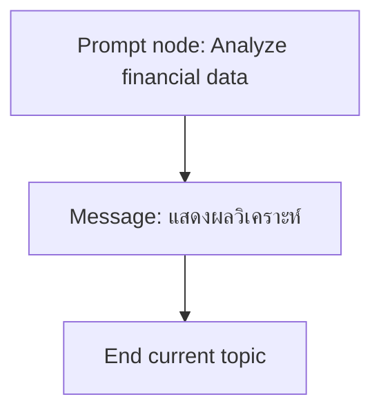
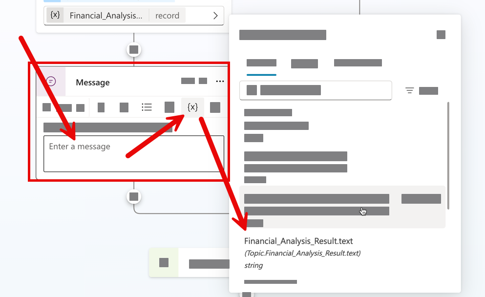

# แบบฝึกหัดที่ 4: แสดงผลวิเคราะห์ในแชต

🔑 **ต้องการ M365 Copilot License + สิทธิ์เข้าใช้ Copilot Studio**

แบบฝึกหัดนี้จะต่อยอดจาก Topic เดิมที่มี node `Analyze financial data` แล้ว โดยเพิ่ม **Message** node เพื่อแสดงผลลัพธ์ Markdown ที่ได้จาก Prompt node กลับมาในแชต และปิด Topic ให้สมบูรณ์



---

## Practice 1: เพิ่ม Message node เพื่อแสดงผลวิเคราะห์

1. เปิด Topic `Monthly Report Intake`
2. จาก node `Analyze financial data` ให้กด **+** แล้วเลือก **Send a message**
3. ตั้งชื่อ node ว่า

   ```text
   Show financial analysis
   ```

4. ในข้อความของ Message node ให้แทรก output จาก Prompt node `Analyze financial data` หรือใช้ตัวแปร `FinancialAnalysisResult`

   

   > **ขั้นตอน:** กดที่ฟิลด์ข้อความ Message node เพื่อแทรก dynamic content หรือเลือกตัวแปร `FinancialAnalysisResult` ที่อยู่ในข้อความ

   > **ผลลัพธ์:** หลังจากแทรกตัวแปร จะเห็นตัวแปร Chip ปรากฏในข้อความ Message node พร้อมแสดงผล Markdown อย่างเรียบร้อย

5. กด **Save**

> 💡 **Tip:** ถ้าผลลัพธ์จาก Prompt node เป็น Markdown อยู่แล้ว Message node นี้จะช่วยให้ผู้เรียนเห็นผลลัพธ์ได้ทันทีโดยไม่ต้องเพิ่ม logic อื่น

---

## Practice 2: ปิด Topic หลังแสดงผลลัพธ์

1. จาก node `Show financial analysis` ให้กด **+**
2. เลือก **Topic management** > **End current topic**
3. กด **Save**

---

## Practice 3: ทดสอบ flow แบบ end-to-end

1. เปิด **Test** panel
2. เริ่มด้วย prompt เช่น

   ```text
   ช่วยสรุปรายงานการเงินรายเดือน
   ```

3. ตอบค่าระหว่างทางให้ครบ
   - Preferred report format: `Executive Summary`
4. เมื่อระบบถามหาไฟล์ ให้ upload
   - `SET-Monthly-Financial-Report-May2026.xlsx`
5. ตรวจว่า Message node แสดงผลวิเคราะห์แบบ Markdown กลับมาในแชตได้
6. ตรวจว่า Topic จบการทำงานหลังแสดงผลลัพธ์เรียบร้อย

---

## สรุป

ในแบบฝึกหัดนี้ คุณได้ทำให้ Topic แสดงผลวิเคราะห์กลับมาในแชตแบบเรียบง่ายและครบเส้นทาง พร้อมใช้เป็นฐานสำหรับการต่อยอดใน Module 4

ขั้นตอนถัดไป → [ทำ Hybrid Topic: Structured + Generative](../../module-4/exercise-1-hybrid-topic-with-generative/README.md)
