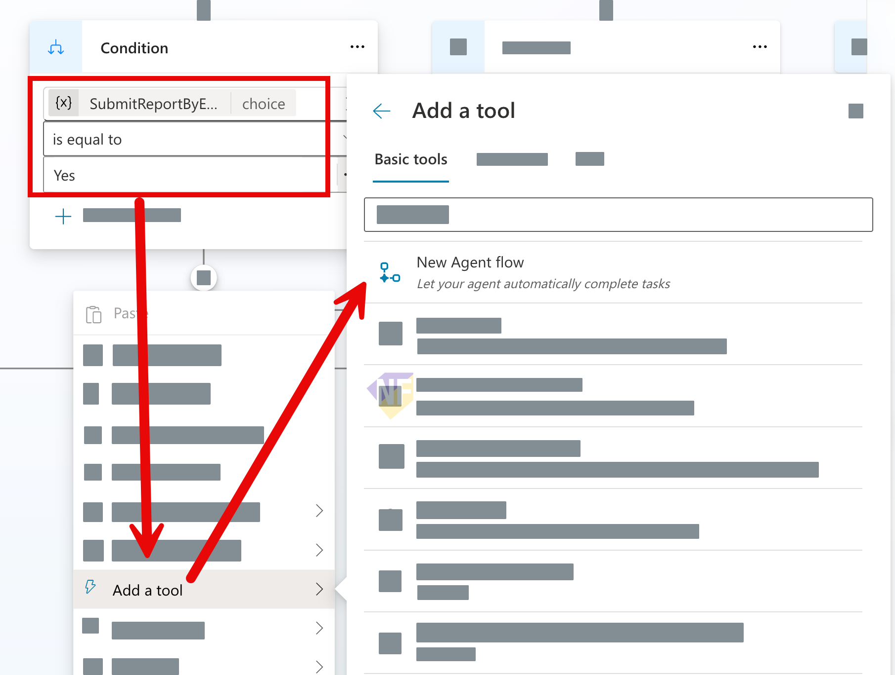
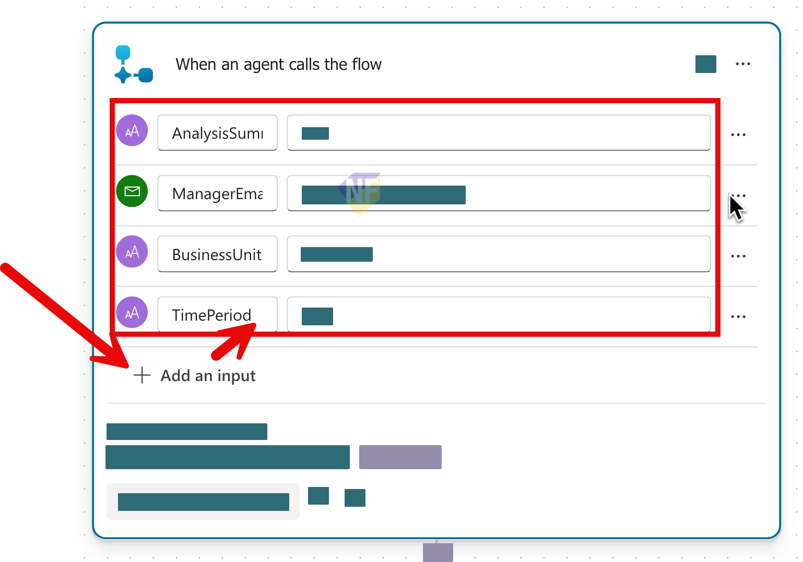
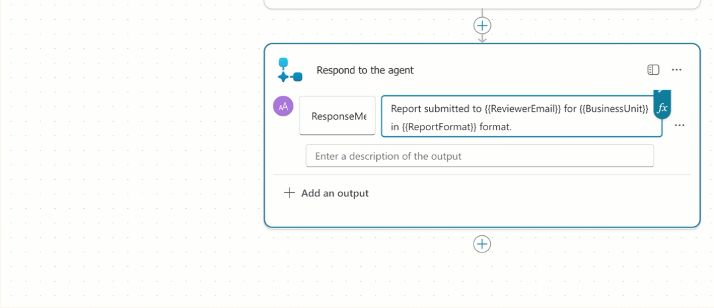
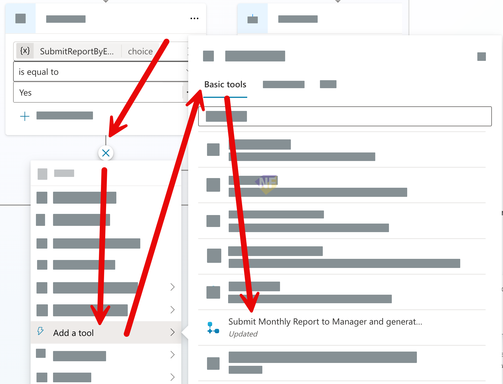

# แบบฝึกหัดที่ 6: เพิ่ม Agent Flow สำหรับส่งอีเมลรายงาน

🔑 **ต้องการ M365 Copilot License + สิทธิ์เข้าใช้ Copilot Studio**

แบบฝึกหัดนี้จะต่อยอดจาก `Financial Report Assistant` ตัวเดิม โดยเพิ่มความสามารถที่ใกล้เคียงงานจริงมากขึ้น คือหลังจาก Agent วิเคราะห์รายงานและแสดงผลในแชตแล้ว ผู้ใช้สามารถสั่งให้ Agent **ส่งสรุปรายงานทางอีเมล** ไปยังผู้รับที่ต้องการได้ผ่าน **Agent Flow** ที่รับค่าจาก Topic แล้วส่งข้อความตอบกลับมายัง Topic เดิม

> ⚠️ **Note:** แบบฝึกหัดนี้คาดหวังว่าอย่างน้อยผู้เรียนได้ทำ Module 3 Exercise 3-4 มาก่อน เพื่อให้มี Topic `Monthly Report Intake`, output ชื่อ `FinancialAnalysisResult`, และ Message node `Show financial analysis` พร้อมใช้งานแล้ว

```mermaid
flowchart TD
    A[User ขอวิเคราะห์รายงานการเงิน] --> B[Monthly Report Intake]
    B --> C[Analyze financial data]
    C --> D[Show financial analysis]
   D --> E[Ask Send Report by Email]
    E -->|No| F[Message: เก็บเป็น draft]
   E -->|Yes| G[Ask Recipient Email]

   subgraph AGENT_FLOW[Agent flow]
      H[When an agent calls the flow]
      I[Send an email (V2)]
      J[Respond to the agent]
      H --> I
      I --> J
   end

   G --> H
   J --> K[Message: แจ้งผลส่งอีเมล]
    F --> L[End current topic]
   K --> L
```


---

## Practice 1: ทบทวน flow เดิมและกำหนดเป้าหมายของ action

1. เปิด Agent `Financial Report Assistant` ที่สร้างจาก Module 3
2. ไปที่ Topic `Monthly Report Intake` แล้วทบทวนว่าตอนนี้ flow เดิมทำอะไรได้แล้วบ้าง
   - รับค่า `BusinessUnit`
   - รับค่า `ReportPeriod`
   - วิเคราะห์ข้อมูลจากไฟล์ Excel
   - เก็บผลลัพธ์ผ่านตัวแปร `FinancialAnalysisResult`
   - แสดงผลลัพธ์ในแชตผ่าน node `Show financial analysis`
3. ตั้งเป้าหมายของแบบฝึกหัดนี้ให้ชัดว่า หลังจากผู้ใช้เห็นผลวิเคราะห์แล้ว Agent ต้องถามต่อว่า

   ```text
   ต้องการส่งสรุปรายงานนี้ทางอีเมลหรือไม่
   ```

4. ถ้าผู้ใช้ตอบว่าใช่ เราจะให้ Agent เรียก Tool ที่เชื่อมกับ Agent Flow เพื่อส่งข้อมูลไปยังอีเมลปลายทางที่ผู้ใช้ระบุ
5. ในแบบฝึกหัดนี้ให้ใช้ชื่อ Agent Flow ว่า

   ```text
   Send Monthly Report Summary Email
   ```

6. และให้กำหนดผลลัพธ์ปลายทางของ Tool เป็นข้อความสั้นๆ เช่น

   ```text
   Report summary sent to reviewer@example.com for Aromatics in May 2026.
   ```

> 💡 **Tip:** ในช่วงแรกยังไม่จำเป็นต้องทำ workflow ซับซ้อน เช่นหลายขั้นตอนหรือเขียนกลับ SharePoint ให้เริ่มจาก action ที่มี input ชัดเจน ส่งอีเมลได้จริง และส่งข้อความตอบกลับได้ก่อน

---

## Practice 2: เตรียม Topic ให้พร้อมสำหรับเรียก Agent Flow

1. จากด้านล่างของ condition node `finalize report (no)` ให้เพิ่ม **Question** node เพื่อถามผู้ใช้ว่าต้องการส่งรายงานนี้ทางอีเมลหรือไม่

   ### Node name
   ```text
   Ask Send Report by Email
   ```

   ### Message
   ```text
   คุณต้องการส่งสรุปรายงานนี้ทางอีเมลหรือไม่?
   ```

   ### Identify
   ```text
   Multiple choice of options
   ```

   ### Options
   ```text
   Yes
   ```
   ```text
   No
   ```

   ### Save user response as
   ```text
   SubmitReportByEmailAnswer
   ```
2.   กด **Save** 
3.  ในส่วน answer node  ที่เป็น `Yes` ให้ตั้งชื่อว่า
   ```text
   Confirm submit report
   ```
4. ต่อจาก node `Confirm submit report` ให้เพิ่ม Question node อีกหนึ่งตัวเพื่อเก็บอีเมลผู้รับ

   ### Node name
   ```text
   Ask Recipient Email
   ```

   ### Message
   ```text
   กรุณาระบุอีเมลผู้รับที่ต้องการส่งสรุปรายงาน
   ```

   ### Identify
   ```text
   Entire response
   ```

   ### Save user response as
   ```text
   ReviewerEmail
   ```

5. กด **Save**

> 💡 **Tip:** ตัวแปร `ReviewerEmail` จากขั้นตอนนี้จะถูกนำไป map เข้า input `ReviewerEmail` ของ Agent Flow ใน Practice ถัดไป

---

## Practice 3: สร้าง Agent Flow และใช้ Send an email (V2)

1. ถัดจาก node `Ask Recipient Email` ให้เพิ่ม **Add a tool > New Agent flow** เพื่อทำการสร้าง Agent Flow ใหม่
   
2.  เราจะเข้าสู่หน้า Agent flow designer ให้กดปุ่ม **Save draft** ก่อนที่จะดำเนินขั้นตอนต่อไป
   
6. จากด้านบนซ้าย ให้อยู่ในส่วนของหน้า Designer > คลิกที่ชื่อเพื่อเปลี่ยนชื่อเป็น 
   - ชื่อ flow: 
      ```
      Submit Monthly Report to Manager and generate document
      ```
   - Input parameters: `BusinessUnit`, `ReportFormat`, `AnalysisSummary`, `ReviewerEmail`
   - Output parameters: `ApprovalSubmissionResult`
   - ใน flow นี้ให้สร้างขั้นตอนธุรกิจง่ายๆ ที่ส่งอีเมลขออนุมัติไปยัง reviewer และสร้างไฟล์ DOCX แบบสรุปรายงานอย่างง่าย (ตามสิทธิ์ที่ tenant ของคุณมี)

7.  ที่ action `When an agent calls the flow` ให้เพิ่ม input parameters อย่างน้อย 4 ค่าเป็นประเภท ดังนี้

   ```text
   BusinessUnit (text)
   ```
   ```text
   TimePeriod (text)
   ```
   ```text
   AnalysisSummary (text)
   ```
   ```text
   ReviewerEmail (email)
   ```
   

5. สังเกตว่า input เหล่านี้คือค่าที่ Topic จะส่งเข้ามาให้ flow ใช้งานต่อใน action อื่นๆ
6. ใต้ action `When an agent calls the flow` ให้เพิ่ม action `Send an email (V2)` จาก Office 365 Outlook
7. กำหนดค่าหลักของ `Send an email (V2)` ตามนี้

   ### To
   ```text
   ReviewerEmail
   ```

   ### Subject
   ```text
   Monthly report summary for {{BusinessUnit}} - {{TimePeriod}}
   ```

   ### Body
   ```html
   <p>Hello,</p>
   <p>Here is the monthly report summary for <strong>{{BusinessUnit}}</strong> in <strong>{{TimePeriod}}</strong>.</p>
   <p>{{AnalysisSummary}}</p>
   ```

8. ถ้าต้องการ สามารถเปิดใช้ field เพิ่มเติมอย่าง `CC`, `BCC`, `Reply To`, หรือ `Importance` ได้ แต่สำหรับแบบฝึกหัดนี้ยังไม่จำเป็น
9. ตามข้อมูลอ้างอิงของ Microsoft Learn, `Send an email (V2)` ต้องมีอย่างน้อย `To`, `Subject`, และ `Body` จึงควรตรวจให้ครบก่อนกดบันทึก
10. ที่ action `Respond to the agent` ให้กำหนดชื่อของตัวแปร output กลับมายัง Agent 1 ค่า

      ```text
      ResponseMessage
      ```

11. ให้คัดลอกตัวอย่างข้อความกำหนดลงในค่าตัวแปร output ที่ flow ควรส่งกลับ

      ```text
      Report summary sent to {{ReviewerEmail}} for {{BusinessUnit}} in {{TimePeriod}}.
      ```
   
12. ทำการแทนที่ค่าตัวแปรทั้งสามตัวด้วยการกดเลือกปุ่ม enter data แล้วเลือก input parameter ที่เราสร้างไว้ใน action `When an agent calls the flow` ตามลำดับ
   
13. กด **Save draft** และ **Publish** ให้เรียบร้อย

> ⚠️ **Note:** Microsoft Learn ระบุว่า `Send an email (V2)` ไม่ได้ส่ง `message id` กลับมาให้ใช้ต่อในแบบตรงๆ ดังนั้นในแบบฝึกหัดนี้ให้ใช้ `ResponseMessage` เป็นผลลัพธ์หลักที่ Topic จะนำไปแสดงในแชต

---

## Practice 4: ต่อ Topic เดิมให้เรียก Tool

1.  กลับไปที่ Agent Designer และเปิด Topic `Monthly Report Intake`
2. ไปที่ node `Ask Recipient Email`

3. ต่อจาก `Ask Recipient Email` ให้เพิ่ม **Add a Tool** แล้วเลือก Agent flow `Send Monthly Report Summary Email`
   
4. map ค่า input ของ Tool ตามนี้
   #### BusinessUnit
   ```text
   BusinessUnit
   ```
   #### TimePeriod
   ```text
   ReportPeriod
   ```
   #### AnalysisSummary
   ```text
   FinancialAnalysisResult.text
   ```
   #### ReviewerEmail
   ```text
   ReviewerEmail
   ```


5. สร้าง output variable ใหม่สำหรับผลลัพธ์ของ Tool เช่น

   ```text
   SubmitMonthlyReportResultMessage
   ```

6.  เพิ่ม **Message** node ต่อจาก Tool node เพื่อแสดงผลลัพธ์ที่ส่งกลับมาจาก flow โดยให้ทำการแทนที่ค่าตัวแปรลงไปในส่วนของ message ดังนี้
      #### Node name:
      ```text
      Show submit report result
      ```
      #### Message:
      ```text
      {{SubmitMonthlyReportResultMessage}}
      ```   

7.  ปิดท้ายเส้นทางนี้ด้วย **End curren
8.  t topic**
9.  ส่วนเส้นทาง `Keep as Draft (No)` ให้แสดงข้อความยืนยันว่าเก็บผลลัพธ์ไว้เป็น draft แล้วจึงใช้ **End current topic**

   > ⚠️ **Note:** ถ้าต้องการลดความซับซ้อน ให้เริ่มจากการใช้ `FinancialAnalysisResult` แบบเต็มทั้งก้อนเป็น `AnalysisSummary` ไปก่อน ยังไม่จำเป็นต้องแยกย่อยเป็น KPI หรือ risk ในแบบฝึกหัดนี้

---

## Practice 5: ทดสอบ Happy Path และ Cancel Path

1. เปิด **Test your agent**
2. เริ่มด้วย prompt ตัวอย่างนี้

   ```text
   ช่วยสรุปรายงานการเงินของ BU Aromatics
   ```

3. ตอบค่าระหว่างทางให้ครบจนได้ผลวิเคราะห์จาก `FinancialAnalysisResult`
4. เมื่อระบบถามว่าต้องการส่งทางอีเมลหรือไม่ ให้ทดสอบ **Happy Path** โดยตอบ

   ```text
   Yes
   ```

5. ใส่อีเมลผู้รับ เช่น

   ```text
   finance-manager@set.example
   ```

6. ตรวจว่าระบบเรียก Tool สำเร็จและมีข้อความยืนยันกลับมา เช่น

   ```text
   Report summary sent to finance-manager@set.example for Aromatics in May 2026.
   ```

7. จากนั้นทดสอบ **Cancel Path** อีกรอบ โดยเริ่ม flow เดิมใหม่ แต่ที่คำถาม `Ask Send Report by Email` ให้ตอบ

   ```text
   No
   ```

8. Expected result ของเส้นทางนี้คือ
   - ระบบไม่เรียก Tool
   - ระบบแจ้งว่าเก็บ draft ไว้เรียบร้อยแล้ว
   - Topic จบอย่างปลอดภัย

---

## สรุป

ในแบบฝึกหัดนี้ คุณได้เพิ่มความสามารถเชิงธุรกิจให้ Agent เดิมด้วย Agent Flow ที่รับค่าจาก Topic ไปใช้กับ `Send an email (V2)` แล้วส่ง `ResponseMessage` กลับมายัง Topic เดิม ทำให้ Agent ไม่ได้แค่วิเคราะห์ข้อมูล แต่สามารถส่งสรุปรายงานต่อทางอีเมลได้ทันที

ขั้นตอนถัดไป → [ออกแบบ Fallback และ Mini Test Cycle](../../module-5/exercise-1-fallback-and-mini-test/README.md)
