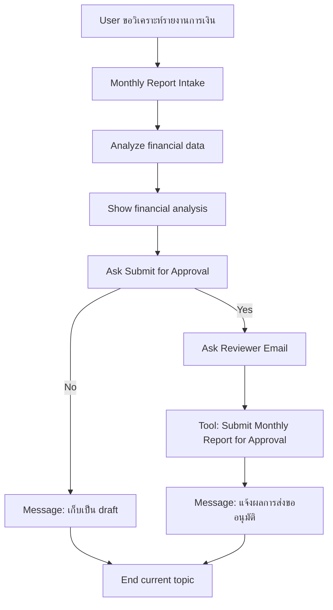
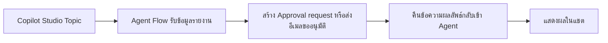

# แบบฝึกหัดที่ 6: เพิ่ม Tool และ Agent Flow สำหรับส่งขออนุมัติรายงาน

🔑 **ต้องการ M365 Copilot License + สิทธิ์เข้าใช้ Copilot Studio**

แบบฝึกหัดนี้จะต่อยอดจาก `Financial Report Assistant` ตัวเดิม โดยเพิ่มความสามารถที่ใกล้เคียงงานจริงมากขึ้น คือหลังจาก Agent วิเคราะห์รายงานและแสดงผลในแชตแล้ว ผู้ใช้สามารถสั่งให้ Agent **ส่งคำขออนุมัติ** ไปยังผู้ตรวจสอบได้ผ่าน **Agent Flow** ที่ถูกเพิ่มเข้า Agent เป็น **Tool**

> ⚠️ **Note:** แบบฝึกหัดนี้คาดหวังว่าอย่างน้อยผู้เรียนได้ทำ Module 3 Exercise 3-4 มาก่อน เพื่อให้มี Topic `Monthly Report Intake`, output ชื่อ `FinancialAnalysisResult`, และ Message node `Show financial analysis` พร้อมใช้งานแล้ว





---

## Practice 1: ทบทวน flow เดิมและกำหนดเป้าหมายของ action

1. เปิด Agent `Financial Report Assistant` ที่สร้างจาก Module 3
2. ไปที่ Topic `Monthly Report Intake` แล้วทบทวนว่าตอนนี้ flow เดิมทำอะไรได้แล้วบ้าง
   - รับค่า `BusinessUnit`
   - รับค่า `ReportFormat`
   - วิเคราะห์ข้อมูลจากไฟล์ Excel
   - เก็บผลลัพธ์ผ่านตัวแปร `FinancialAnalysisResult`
   - แสดงผลลัพธ์ในแชตผ่าน node `Show financial analysis`
3. ตั้งเป้าหมายของแบบฝึกหัดนี้ให้ชัดว่า หลังจากผู้ใช้เห็นผลวิเคราะห์แล้ว Agent ต้องถามต่อว่า

   ```text
   ต้องการส่งสรุปรายงานนี้ไปขออนุมัติหรือไม่
   ```

4. ถ้าผู้ใช้ตอบว่าใช่ เราจะให้ Agent เรียก Tool ที่เชื่อมกับ Agent Flow เพื่อส่งข้อมูลไปยังผู้อนุมัติ
5. ในแบบฝึกหัดนี้ให้ใช้ชื่อ Agent Flow ว่า

   ```text
   Submit Monthly Report for Approval
   ```

6. และให้กำหนดผลลัพธ์ปลายทางของ Tool เป็นข้อความสั้นๆ เช่น

   ```text
   Approval request submitted to reviewer@example.com for Aromatics in Executive Summary format.
   ```

> 💡 **Tip:** ในช่วงแรกยังไม่จำเป็นต้องทำ workflow ซับซ้อน เช่นหลายชั้นอนุมัติหรือเขียนกลับ SharePoint ให้เริ่มจาก action ที่มี input ชัดเจนและส่งข้อความตอบกลับได้ก่อน

---

## Practice 2: สร้าง Agent Flow สำหรับส่งคำขออนุมัติ

1. ไปที่หน้า **Flows** จากเมนูด้านซ้ายของ Copilot Studio แล้วเลือก **New flow** > **Agent flow**
2. ระบบจะเปิด flow designer พร้อม starter template ที่มี 2 action สำคัญมาให้แล้ว คือ

   ```text
   When an agent calls the flow
   Respond to the agent
   ```

3. ตั้งชื่อ flow ว่า

   ```text
   Submit Monthly Report for Approval
   ```

4. ที่ action `When an agent calls the flow` ให้เพิ่ม input parameters อย่างน้อย 4 ค่าเป็นประเภทข้อความดังนี้

   ```text
   BusinessUnit
   ReportFormat
   AnalysisSummary
   ReviewerEmail
   ```

5. ภายใน flow ให้สร้างขั้นตอนธุรกิจแบบง่ายที่สุด 1 อย่างต่อไปนี้ตามสิทธิ์ที่ tenant ของคุณมี
   - สร้าง approval request
   - หรือส่งอีเมลขออนุมัติไปยัง reviewer
6. ที่ action `Respond to the agent` ให้กำหนด output กลับมายัง Agent เพียง 1 ค่า เช่น

   ```text
   ApprovalSubmissionResult
   ```

7. ตัวอย่างข้อความ output ที่ flow ควรส่งกลับ:

   ```text
   Approval request submitted to {{ReviewerEmail}} for {{BusinessUnit}} in {{ReportFormat}} format.
   ```

8. ตรวจสอบที่ `Respond to the agent` ว่า flow ถูกตั้งค่าให้ตอบกลับแบบ real-time ไม่ใช่ asynchronous
9. กด **Publish** ให้เรียบร้อยก่อนกลับมาที่ Copilot Studio

> ⚠️ **Note:** flow ที่ใช้เป็น Tool ของ Agent ควรตอบกลับเร็วและส่งข้อมูลกลับมาเท่าที่จำเป็น เพื่อให้ใช้ในแชตได้ลื่นขึ้น

---

## Practice 3: เพิ่ม Agent Flow เข้า Agent เป็น Tool

1. กลับมาที่หน้า Agent แล้วไปที่ส่วน **Tools**
2. กด **Add a tool** แล้วเลือก flow ที่สร้างไว้ชื่อ `Submit Monthly Report for Approval`
3. ตรวจสอบชื่อและคำอธิบายของ Tool ให้ชัดเจน เช่น

   ```text
   Use this tool when the user confirms that the monthly financial report draft should be sent for approval.
   ```

4. กด **Save**
5. ถ้า Agent ของคุณมี instruction ที่อธิบายขอบเขตอยู่แล้ว ให้เพิ่มบรรทัดสั้นๆ เพื่อระบุความสามารถใหม่นี้ เช่น

   ```text
   If the user confirms that a monthly report draft is ready, use Submit Monthly Report for Approval to send an approval request.
   ```

---

## Practice 4: ต่อ Topic เดิมให้ถามและเรียก Tool

1. เปิด Topic `Monthly Report Intake`
2. ไปที่ node `Show financial analysis`
3. ถ้า Topic มี **End current topic** ต่อจาก node นี้อยู่แล้ว ให้ลบออกชั่วคราวก่อน เพื่อให้เราต่อ flow เพิ่มได้
4. เพิ่ม **Question** node ใหม่ใต้ `Show financial analysis` แล้วตั้งค่าดังนี้

   ### Node name
   ```text
   Ask Submit for Approval
   ```

   ### Message
   ```text
   คุณต้องการส่ง draft นี้ไปขออนุมัติหรือไม่?
   ```

   ### Identify
   ```text
   Multiple choice of options
   ```

   ### Options
   ```text
   Yes
   ```
   ```text
   No
   ```

   ### Save user response as
   ```text
   SubmitApprovalAnswer
   ```

5. เพิ่ม **Condition** node เพื่อแยก 2 เส้นทาง
   - `Submit for Approval (Yes)`
   - `Keep as Draft (No)`
6. ในเส้นทาง `Submit for Approval (Yes)` เพิ่ม **Question** node เพื่อรับอีเมลของผู้อนุมัติ

   ### Node name
   ```text
   Ask Reviewer Email
   ```

   ### Message
   ```text
   กรุณาระบุอีเมลของผู้อนุมัติที่ต้องการส่งคำขอ
   ```

   ### Identify
   ```text
   User's entire response
   ```

   ### Save user response as
   ```text
   ReviewerEmail
   ```

7. ต่อจาก `Ask Reviewer Email` ให้เพิ่ม **Tool** node แล้วเลือก Tool `Submit Monthly Report for Approval`
8. map ค่า input ของ Tool ตามนี้

   ```text
   BusinessUnit = Topic.BusinessUnit
   ReportFormat = Topic.ReportFormat
   AnalysisSummary = Topic.FinancialAnalysisResult
   ReviewerEmail = Topic.ReviewerEmail
   ```

9. สร้าง output variable ใหม่สำหรับผลลัพธ์ของ Tool เช่น

   ```text
   ApprovalSubmissionResult
   ```

10. เพิ่ม **Message** node ต่อจาก Tool node เพื่อแสดงผลลัพธ์ที่ส่งกลับมาจาก flow
11. ปิดท้ายเส้นทางนี้ด้วย **End current topic**
12. ส่วนเส้นทาง `Keep as Draft (No)` ให้แสดงข้อความยืนยันว่าเก็บผลลัพธ์ไว้เป็น draft แล้วจึงใช้ **End current topic**

> ⚠️ **Note:** ถ้าต้องการลดความซับซ้อน ให้เริ่มจากการใช้ `FinancialAnalysisResult` แบบเต็มทั้งก้อนเป็น `AnalysisSummary` ไปก่อน ยังไม่จำเป็นต้องแยกย่อยเป็น KPI หรือ risk ในแบบฝึกหัดนี้

---

## Practice 5: ทดสอบ Happy Path และ Cancel Path

1. เปิด **Test your agent**
2. เริ่มด้วย prompt ตัวอย่างนี้

   ```text
   ช่วยสรุปรายงานการเงินของ BU Aromatics
   ```

3. ตอบค่าระหว่างทางให้ครบจนได้ผลวิเคราะห์จาก `FinancialAnalysisResult`
4. เมื่อระบบถามว่าต้องการส่งขออนุมัติหรือไม่ ให้ทดสอบ **Happy Path** โดยตอบ

   ```text
   Yes
   ```

5. ใส่อีเมล reviewer เช่น

   ```text
   finance-manager@set.example
   ```

6. ตรวจว่าระบบเรียก Tool สำเร็จและมีข้อความยืนยันกลับมา เช่น

   ```text
   Approval request submitted to finance-manager@set.example for Aromatics in Executive Summary format.
   ```

7. จากนั้นทดสอบ **Cancel Path** อีกรอบ โดยเริ่ม flow เดิมใหม่ แต่ที่คำถาม `Ask Submit for Approval` ให้ตอบ

   ```text
   No
   ```

8. Expected result ของเส้นทางนี้คือ
   - ระบบไม่เรียก Tool
   - ระบบแจ้งว่าเก็บ draft ไว้เรียบร้อยแล้ว
   - Topic จบอย่างปลอดภัย

---

## สรุป

ในแบบฝึกหัดนี้ คุณได้เพิ่มความสามารถเชิงธุรกิจให้ Agent เดิมด้วย Tool และ Agent Flow สำหรับส่งคำขออนุมัติหลังจากแสดงผลวิเคราะห์แล้ว ทำให้ Agent ไม่ได้แค่วิเคราะห์ข้อมูล แต่สามารถเริ่ม workflow ที่ใช้งานจริงต่อได้ทันที

ขั้นตอนถัดไป → [ออกแบบ Fallback และ Mini Test Cycle](../../module-5/exercise-1-fallback-and-mini-test/README.md)
