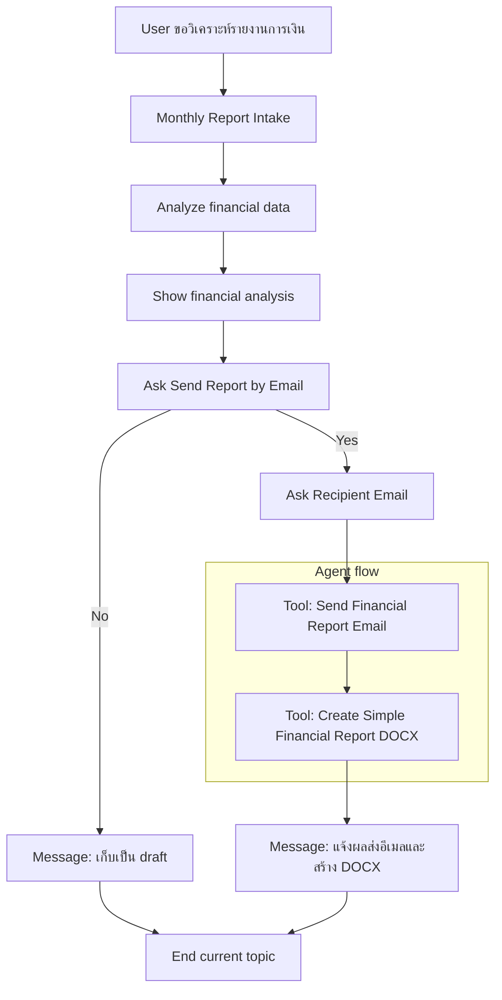

# แบบฝึกหัดที่ 6: เพิ่ม Agent Flow สำหรับส่งรายงาน

🔑 **ต้องการ M365 Copilot License + สิทธิ์เข้าใช้ Copilot Studio**

แบบฝึกหัดนี้จะต่อยอดจาก `Financial Report Assistant` ตัวเดิม โดยเพิ่มความสามารถที่ใกล้เคียงงานจริงมากขึ้น คือหลังจาก Agent วิเคราะห์รายงานและแสดงผลในแชตแล้ว ผู้ใช้สามารถสั่งให้ Agent **ส่งรายงาน** ไปยังผู้ตรวจสอบได้ผ่าน **Agent Flow** ที่ถูกเพิ่มเข้า Agent 

> ⚠️ **Note:** แบบฝึกหัดนี้คาดหวังว่าอย่างน้อยผู้เรียนได้ทำ Module 3 Exercise 3-4 มาก่อน เพื่อให้มี Topic `Monthly Report Intake`, output ชื่อ `FinancialAnalysisResult`, และ Message node `Show financial analysis` พร้อมใช้งานแล้ว




---

## Practice 1: ทบทวน flow เดิมและกำหนดเป้าหมายของ action

1. เปิด Agent `Financial Report Assistant` ที่สร้างจาก Module 3
2. ไปที่ Topic `Monthly Report Intake` แล้วทบทวนว่าตอนนี้ flow เดิมทำอะไรได้แล้วบ้าง
   - รับค่า `BusinessUnit`
   - รับค่า `ReportFormat`
   - วิเคราะห์ข้อมูลจากไฟล์ Excel
   - เก็บผลลัพธ์ผ่านตัวแปร `FinancialAnalysisResult`
   - แสดงผลลัพธ์ในแชตผ่าน node `Show financial analysis`
3. ตั้งเป้าหมายของแบบฝึกหัดนี้ให้ชัดว่า หลังจากผู้ใช้เห็นผลวิเคราะห์แล้ว Agent ต้องถามต่อว่า

   ```text
   ต้องการส่งสรุปรายงานนี้ไปให้หัวหน้าแผนกหรือไม่
   ```

4. ถ้าผู้ใช้ตอบว่าใช่ เราจะให้ Agent เรียก Tool ที่เชื่อมกับ Agent Flow เพื่อส่งข้อมูลไปยังผู้อนุมัติ
5. ในแบบฝึกหัดนี้ให้ใช้ชื่อ Agent Flow ว่า

   ```text
   Submit Monthly Report to Manager and generate document
   ```

6. และให้กำหนดผลลัพธ์ปลายทางของ Tool เป็นข้อความสั้นๆ เช่น

   ```text
   Report submitted to reviewer@example.com for Aromatics in Executive Summary format.
   ```

> 💡 **Tip:** ในช่วงแรกยังไม่จำเป็นต้องทำ workflow ซับซ้อน เช่นหลายชั้นอนุมัติหรือเขียนกลับ SharePoint ให้เริ่มจาก action ที่มี input ชัดเจนและส่งข้อความตอบกลับได้ก่อน

---

## Practice 2: สร้าง condition node เพื่อถามผู้ใช้ว่าต้องการส่งรายงานหรือไม่

1. จากด้านล่างของ condition node 'finalize report (no)' ให้เพิ่ม **Question** node เพื่อถามผู้ใช้ว่าต้องการส่งรายงานนี้ไปขออนุมัติหรือไม่

   ### Node name
   ```text
   Ask Send Report by Email and generate document
   ```

   ### Message
   ```text
   คุณต้องการส่งสรุปรายงานนี้ทางอีเมลหรือไม่?
   ```

   ### Identify
   ```text
   Multiple choice of options
   ```

   ### Options
   ```text
   Yes
   ```
   ```text
   No
   ```

   ### Save user response as
   ```text
   SubmitReportByEmailAnswer
   ```
2. กด **Save** 
3.  ในส่วน answer node  ที่เป็น `Yes` ให้ตั้งชื่อว่า
   ```text
   Confirm submit report
   ```
4. เตรียม Question node สำหรับเก็บอีเมลผู้ตรวจสอบ โดย node นี้จะถูกวางต่อจาก `Confirm submit report` (ซึ่งจะสร้างใน Practice 3)

   ### Node name
   ```text
   Ask Recipient Email
   ```

   ### Message
   ```text
   กรุณาระบุอีเมลผู้ตรวจสอบที่ต้องการส่งรายงาน
   ```

   ### Identify
   ```text
   Entire response
   ```

   ### Save user response as
   ```text
   ReviewerEmail
   ```
5. กด **Save**


> 💡 **Tip:** ตัวแปร `ReviewerEmail` จากขั้นตอนนี้จะถูกนำไป map เข้า input `ReviewerEmail` ของ Agent Flow ใน Practice ถัดไป

## Practice 3: สร้าง Agent Flow สำหรับส่งรายงาน

1. ถัดจาก node `Ask Recipient Email` ให้เพิ่ม **Add a tool > New Agent flow** เพื่อสร้าง Agent Flow ใหม่ที่เชื่อมกับ Tool ในขั้นตอนถัดไป
   
2.  เราจะเข้าสู่หน้า Agent flow designer ให้กดปุ่ม Save draft   ก่อนที่จะดำเนินขั้นตอนต่อไป
   
3. จากด้านบนซ้าย ให้อยู่ในส่วนของหน้า Designer > คลิกที่ชื่อเพื่อเปลี่ยนชื่อเป็น 
   - ชื่อ flow: 
      ```
      Submit Monthly Report to Manager and generate document
      ```
  

4.  ที่ action `When an agent calls the flow` ให้เพิ่ม input parameters อย่างน้อย 4 ค่าเป็นประเภท ดังนี้

      ```text
      BusinessUnit (text)
      ```
      ```text
      TimePeriod (text)
      ```
      ```text  
      AnalysisSummary (text)
      ```
      ```text

      ReviewerEmail (email)
      ```
   

5.  ที่ action `Respond to the agent` ให้กำหนดชื่อของตัวแปร output กลับมายัง Agent  1 ค่า 

      ```text
      ResponseMessage
      ```

6. ให้คัดลอกตัวอย่างข้อความกำหนดลงในค่าตัวแปร output ที่ flow ควรส่งกลับ:

      ```text
      Report submitted to {{ReviewerEmail}} for {{BusinessUnit}} in {{TimePeriod}} format.
      ```
   
7.  ทำการแทนที่ ค่าตัวแปรทั้งสามตัว ด้วยการกดเลือกปุ่ม enter data แล้วเลือก input parameter ที่เราสร้างไว้ใน action `When an agent calls the flow` ตามลำดับ
    .gif>)
8.  กด **Save draft** และ **Publish** ให้เรียบร้อย

> ⚠️ **Note:** flow ที่ใช้เป็น Tool ของ Agent ควรตอบกลับเร็วและส่งข้อมูลกลับมาเท่าที่จำเป็น เพื่อให้ใช้ในแชตได้ลื่นขึ้น

---

## Practice 4: ต่อ Topic เดิมให้เรียก Tool

1.  กลับไปที่ Agent Designer และเปิด Topic `Monthly Report Intake`
2. ไปที่ node `Ask Recipient Email` 
3. ต่อจาก `Ask Recipient Email` ให้เพิ่ม **Add a Tool** แล้วเลือก Agent flow `Submit Monthly Report to Manager and generate document`
   
4. map ค่า input ของ Tool ตามนี้
   #### BusinessUnit
   ```text
   BusinessUnit
   ```
   #### TimePeriod
   ```text
   ReportPeriod
   ```
   #### AnalysisSummary
   ```text
   FinancialAnalysisResult.text
   ```
   #### ReviewerEmail (ใส่เป็นอีเมลที่เราต้องการ)
   ```text
   ReviewerEmail
   ```


5. สร้าง output variable ใหม่สำหรับผลลัพธ์ของ Tool  โดยตั้งชื่อว่า

   ```text
   SubmitMonthlyReportResultMessage
   ```

6.  เพิ่ม **Message** node ต่อจาก Tool node เพื่อแสดงผลลัพธ์ที่ส่งกลับมาจาก flow
   #### Node name:
      ```text
      Show submit report result
      ```
   #### Message:
      ```text
      {{SubmitMonthlyReportResultMessage}}
      ```   

7.  ปิดท้ายเส้นทางนี้ด้วย **End current topic**

> ⚠️ **Note:** ถ้าต้องการลดความซับซ้อน ให้เริ่มจากการใช้ `FinancialAnalysisResult` แบบเต็มทั้งก้อนเป็น `AnalysisSummary` ไปก่อน ยังไม่จำเป็นต้องแยกย่อยเป็น KPI หรือ risk ในแบบฝึกหัดนี้

---

## Practice 4: ทดสอบ Happy Path และ Cancel Path

1. เปิด **Test your agent**
2. เริ่มด้วย prompt ตัวอย่างนี้

   ```text
   ช่วยสรุปรายงานการเงินของ BU Aromatics
   ```

3. ตอบค่าระหว่างทางให้ครบจนได้ผลวิเคราะห์จาก `FinancialAnalysisResult`
4. เมื่อระบบถามว่าต้องการส่งขออนุมัติหรือไม่ ให้ทดสอบ **Happy Path** โดยตอบ

   ```text
   Yes
   ```

5. ใส่อีเมล reviewer เช่น

   ```text
   finance-manager@set.example
   ```

6. ตรวจว่าระบบเรียก Tool สำเร็จและมีข้อความยืนยันกลับมา เช่น

   ```text
   Approval request submitted to finance-manager@set.example for Aromatics in Executive Summary format.
   ```

7. จากนั้นทดสอบ **Cancel Path** อีกรอบ โดยเริ่ม flow เดิมใหม่ แต่ที่คำถาม `Ask Submit for Approval` ให้ตอบ

   ```text
   No
   ```

8. Expected result ของเส้นทางนี้คือ
   - ระบบไม่เรียก Tool
   - ระบบแจ้งว่าเก็บ draft ไว้เรียบร้อยแล้ว
   - Topic จบอย่างปลอดภัย

---

## สรุป

ในแบบฝึกหัดนี้ คุณได้เพิ่มความสามารถเชิงธุรกิจให้ Agent เดิมด้วย Tool และ Agent Flow สำหรับส่งคำขออนุมัติหลังจากแสดงผลวิเคราะห์แล้ว ทำให้ Agent ไม่ได้แค่วิเคราะห์ข้อมูล แต่สามารถเริ่ม workflow ที่ใช้งานจริงต่อได้ทันที

ขั้นตอนถัดไป → [ออกแบบ Fallback และ Mini Test Cycle](../../module-5/exercise-1-fallback-and-mini-test/README.md)
