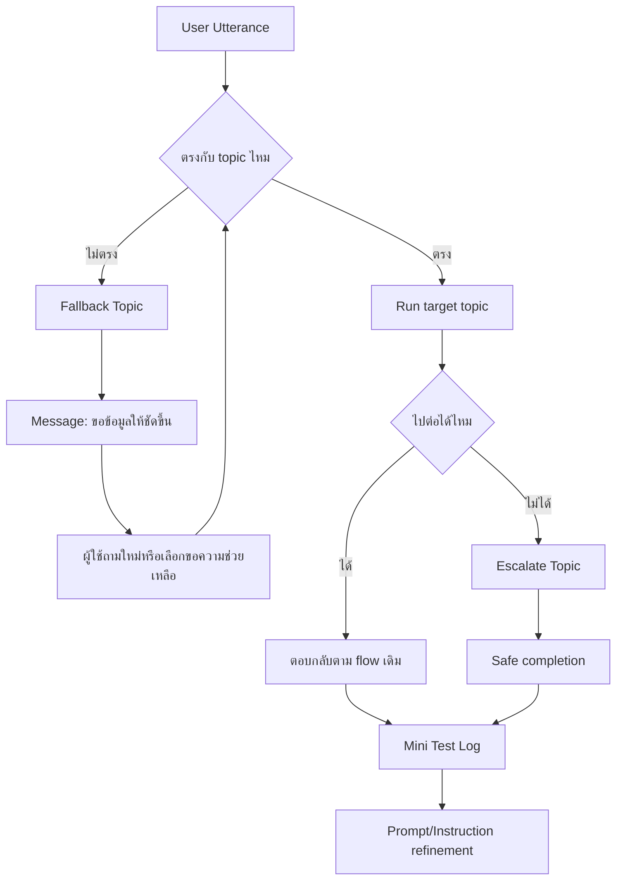
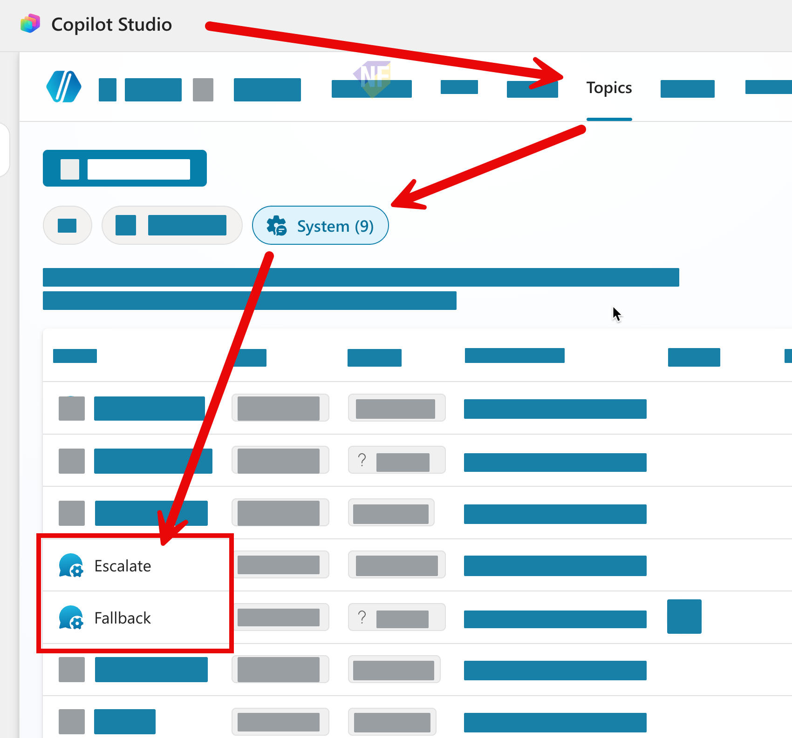
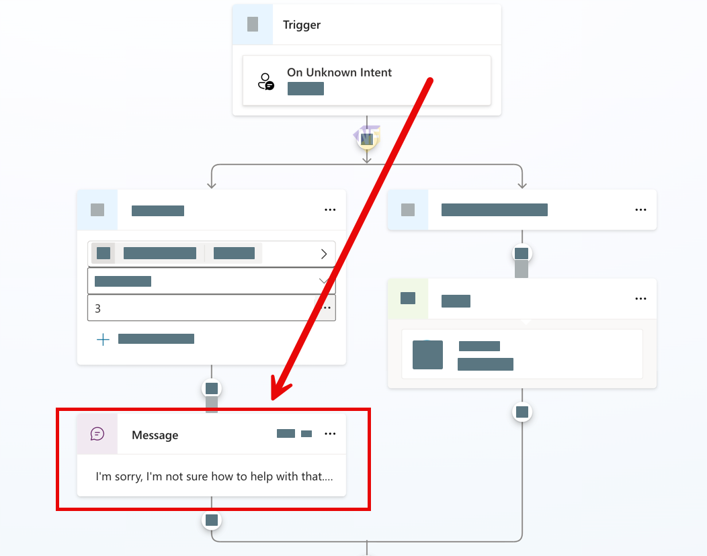
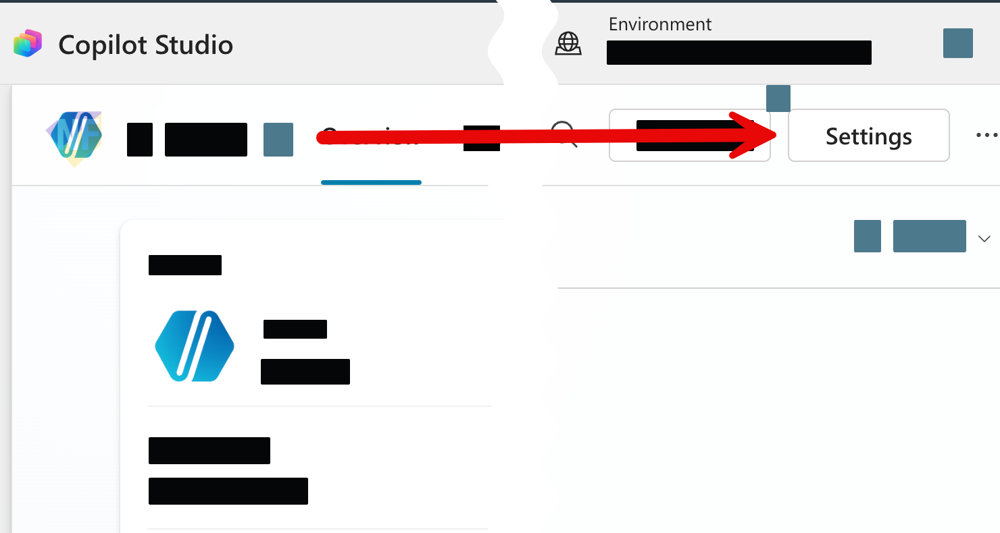
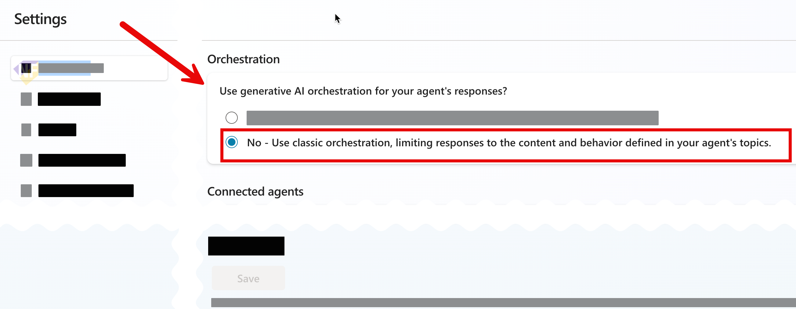

# แบบฝึกหัดที่ 7: ออกแบบ Fallback และ Mini Test Cycle

🔑 **ต้องการ M365 Copilot License + สิทธิ์เข้าใช้ Copilot Studio**

แบบฝึกหัดนี้จะพาเรา harden Agent เดิมให้พร้อมใช้งานจริงมากขึ้น โดยเน้น 3 เรื่องสำคัญคือ **Fallback**, **Escalation**, และ **Mini test cycle** เพื่อให้ Agent ไม่ตอบมั่วเมื่อคำถามไม่ชัดเจน และรู้ว่าควรจบการสนทนาอย่างปลอดภัยเมื่ออยู่นอกขอบเขต

แบบฝึกหัดนี้ต่อยอดจาก flow เวอร์ชันที่เรียบง่ายขึ้นใน Module 3-4 ซึ่ง Agent จะรับค่า **Business Unit**, **Report Format**, รับไฟล์ Excel, แสดงผลวิเคราะห์ในแชต และอาจต่อไปยังขั้นขออนุมัติ



---

## ก่อนเริ่ม

1. ให้แน่ใจก่อนว่าได้ทำ Module 3-4 แล้ว และยังมี Agent เดิมที่ใช้โจทย์วิเคราะห์รายงานการเงินอยู่
2. ใน Agent ควรมี Topic หลักที่รับคำขอ เช่นสรุปรายงานรายเดือน หรือถามความรู้ด้านรายงานการเงิน
3. แบบฝึกหัดนี้จะไม่ได้เพิ่มความสามารถใหม่ขนาดใหญ่ แต่จะช่วยให้ Agent ตอบอย่างปลอดภัยและคาดเดาได้มากขึ้น

> ⚠️ **Note:** ใน Agent `Fallback` และ `Escalate` เป็น **system topics** ที่มีมาให้ใน Agent อยู่แล้ว เราปรับแต่งได้ แต่ควรปรับอย่างระมัดระวังและทดสอบทุกครั้งหลังแก้ไข

---

## Practice 1: ปรับ Fallback system topic ให้ถามกลับอย่างมีบริบท

1. จาก Menu Agent ด้านบนไปที่ **Topics > System > Fallback**
   
2. เปิด Topic Fallback แล้วดูข้อความเดิมของระบบ
   
3. ปรับข้อความใน **Message node** ให้เหมาะกับงานวิเคราะห์รายงานการเงิน โดยบอกผู้ใช้ชัดเจนว่าควรระบุอะไรเพิ่ม เช่น Business Unit, รูปแบบรายงาน, หรือสิ่งที่ต้องการให้ช่วย

   ตัวอย่างข้อความ:

   ```text
   ขอโทษครับ ผมยังจับคำขอนี้ไปยังหัวข้อที่ถูกต้องไม่ได้
   ลองพิมพ์ใหม่โดยระบุ Business Unit และสิ่งที่ต้องการ เช่น
   - สรุปรายงานการเงินของ BU Performance Chemicals แบบ Executive summary
   - วิเคราะห์ต้นทุนของ BU Aromatics จากไฟล์ที่อัปโหลด
   - อธิบายความหมายของ EBITDA
   ```
   
4. กด **Save**
5. กดปุ่ม **Settings** เพื่อเข้าไปปรับค่า orchestration ของ Agent
   
6. ในส่วน **Orchestration** ให้เลือกโหมด **No - Use classic orchestration** เพื่อให้การ route ไป system topics คาดเดาได้ง่ายขึ้นระหว่างฝึกทดสอบ
   
7. กลับมาที่ Overview ของ Agent และแก้ 2 บรรทัดแรกของ Instructions ให้สอดคล้องกับข้อความใน Fallback มากขึ้น เช่น

   ```text
   You are Financial Report Assistant for enterprise business users.
   Only answer questions about financial report analysis, financial reporting terminology, and report distribution policy. Do not answer HR, leave, travel, food, facilities, or general office questions.
   ```

8. กดปุ่ม **Save** ในส่วน instruction
9. เปิด **Test your agent** และลองพิมพ์คำถามที่ไม่เกี่ยวข้อง เช่น

   ```text
   ขอข้อมูลร้านกาแฟใกล้ออฟฟิศ
   ```

10. **Expected result:** ระบบควรเข้า `Fallback` topic และตอบกลับด้วยข้อความที่ช่วยให้ผู้ใช้ถามใหม่ได้ชัดขึ้น

---

## Practice 2: ปรับ Escalate system topic ให้จบการสนทนาอย่างปลอดภัย

1. ไปที่ **Topics > System > Escalate**
2. ตรวจดูว่า Topic นี้สื่อสารกับผู้ใช้อย่างไรเมื่อ Agent ต้องพาไปสู่การคุยกับคนหรือหยุดตอบในเรื่องที่เกินขอบเขต
3. ปรับข้อความให้เหมาะกับบริบทธุรกิจจริง โดยหลีกเลี่ยงการสัญญาว่าระบบจะเปิด ticket หรือส่งต่ออัตโนมัติ ถ้ายังไม่ได้สร้าง flow นั้นใน Agent

   ตัวอย่างข้อความ:

   ```text
   คำขอนี้อาจต้องให้ผู้รับผิดชอบตรวจสอบเพิ่มเติมครับ
   หากเป็นประเด็นเชิงนโยบาย การอนุมัติการเผยแพร่รายงาน หรือข้อมูลที่ต้องการการยืนยันอย่างเป็นทางการ
   กรุณาติดต่อทีม Finance Analyst หรือ Shared Services ตามช่องทางขององค์กร
   ```

4. ทดสอบอย่างน้อย 2 เคส:
   - ผู้ใช้ขอคุยกับคนโดยตรง
   - ผู้ใช้ถามเรื่องนโยบายหรือการอนุมัติที่ Agent ไม่ควรตัดสินใจแทน

---

## Practice 3: ทำ Mini test cycle ด้วย Test your agent

ดาวน์โหลดไฟล์ template สำหรับบันทึกผลการทดสอบได้ที่:
- [mini-test-log-template.xlsx](../../../files/module-2/mini-test-log-template.xlsx)

1. เปิด **Test your agent**
2. ถ้าต้องการตามดูว่า conversation วิ่งไป Topic ไหน ให้เปิด **Track between topics**
3. ถ้าต้องการดูค่าตัวแปรระหว่างทดสอบ ให้เปิด **Variables**
4. สร้างชุดทดสอบ 3 กลุ่มรวมอย่างน้อย 10 เคส ดังนี้:
   - Happy path 4 เคส
   - Edge cases 4 เคส
   - Unknown intent / out-of-scope 2 เคส
5. ใช้ตารางนี้เป็น template ในการบันทึกผล

   | No. | Test Prompt | กลุ่ม | ผลลัพธ์จริง | ผ่าน/ไม่ผ่าน | สิ่งที่ต้องปรับ |
   |---|---|---|---|---|---|
   | 1 | สรุปรายงานของ BU Aromatics | Happy path | เข้า Topic ถูกและสรุปได้ | ✅ ผ่าน | - |
   | 2 | ช่วยสรุปรายงานการเงิน | Edge case | ระบบถาม BU และรูปแบบเพิ่ม | ✅ ผ่าน | - |
   | 3 | สั่งอาหารกลางวันให้ทีม finance | Out-of-scope | เข้า Fallback | ✅ ผ่าน | - |

### ตัวอย่าง test prompts สำหรับ Monthly Report Intake topic

#### Happy path
##### Trigger phrase
```text
ช่วยสรุปรายงานการเงินของ BU Aromatics
```
##### Business Unit
```text
Aromatics
```
##### Style
```text
Business Executive
```
##### File upload
```text
CPALL-Monthly-Financial-Report-May2026.xlsx
```
##### Submit for approval?
```text
No
```

#### Edge cases
##### Trigger phrase
```text
ช่วยสรุปรายงานการเงิน
```
##### Business Unit (⚠️ ไม่มีในรายงาน)
```text
Probitics
```
##### Style
```text
Business Executive
```

#### Unknown intent / out-of-scope
```text
สั่งอาหารกลางวันให้ทีม finance
```

### Tips
ระหว่างทดสอบ ให้สังเกต 4 อย่างนี้ทุกเคส:
- ระบบเข้า Topic ที่ถูกหรือไม่
- ถ้าคำถามไม่ชัดเจน ระบบใช้ Fallback แบบที่ช่วยผู้ใช้ถามใหม่ได้หรือไม่
- ถ้าคำถามอยู่นอกขอบเขต Agent หยุดการทำงาน หรือยังพยายามตอบมั่ว
- output format สม่ำเสมอหรือไม่ เช่น Executive summary, bullet summary, หรือ risk highlights

---

## สรุป

ในแบบฝึกหัดนี้ คุณได้ทำให้ Agent แข็งแรงขึ้นด้วยการปรับ **Fallback** และ **Escalate** system topics ให้เหมาะกับงานจริง พร้อมฝึก **mini test cycle** เพื่อหา failure pattern และปรับ Instructions/Prompt อย่างเป็นระบบก่อนใช้งานจริง

อ่านเพิ่มเติมได้ที่:
- [Microsoft Learn: Use system topics](https://learn.microsoft.com/en-us/microsoft-copilot-studio/authoring-system-topics)
- [Microsoft Learn: Test your agent](https://learn.microsoft.com/en-us/microsoft-copilot-studio/authoring-test-bot)
