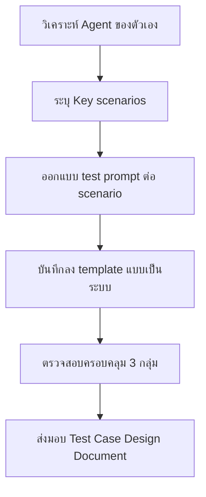

# แบบฝึกหัดที่ 8: ออกแบบชุด Test Prompts สำหรับ Agent ของตัวเอง

🔑 **ต้องการ Agent ของทีมจาก Module 3-4 + Excel template**

แบบฝึกหัดนี้จะพาเราออกแบบชุด test prompts ที่ครอบคลุม 3 กลุ่มสถานการณ์ (Happy path, Edge cases, Out-of-scope) โดยวิเคราะห์ Agent ของตัวเองแล้วเขียน prompt ตามเทมเพลตเฉพาะ เพื่อเตรียมตัวสำหรับการทดสอบจริงในถัดไป

---

## ก่อนเริ่ม

1. เตรียมไฟล์ template สำหรับบันทึก test cases:
   - [mini-test-log-template.xlsx](../../../files/module-2/mini-test-log-template.xlsx)

---

## Practice 1: วิเคราะห์ Agent ของตัวเอง และระบุ Key Scenarios

1. ให้ทบทวนความสามารถหลักของ Agent ที่ทีมสร้างขึ้นใน Module 3-4 ว่าทำอะไร และทำงานแบบไหน
2. เขียนรายการ สถานการณ์ที่ Agent ควรรองรับ (Key Scenarios) โดย แบ่งเป็น 3 กลุ่มหลัก:
   - **Happy path scenarios** (ผู้ใช้ส่งคำขอชัดเจน มีข้อมูลครบ)
   - **Edge case scenarios** (ผู้ใช้ส่งคำขอไม่ชัดเจน ข้อมูลไม่ครบ)
   - **Out-of-scope scenarios** (ผู้ใช้ถามเรื่องนอกขอบเขต)
3. เขียนรายการ Key Scenarios ที่ Agent ควรรองรับ เช่น:
   - **Happy path scenarios** (ผู้ใช้ส่งคำขอชัดเจน มีข้อมูลครบ):
     - "สรุปรายงานการเงินรายเดือนแบบ Executive summary"
     - "[คำขออื่นๆ ที่สอดคล้องกับงาน Agent]"
   - **Edge case scenarios** (ผู้ใช้ส่งคำขอไม่ชัดเจน ข้อมูลไม่ครบ):
     - "ช่วยสรุปรายงานการเงิน" (ไม่ระบุรูปแบบ)
     - "[คำขอที่คลุมเครือในบริบทของ Agent]"
   - **Out-of-scope scenarios** (ผู้ใช้ถามเรื่องนอกขอบเขต):
     - "สั่งอาหารกลางวันให้ทีม"
     - "[คำถามที่ไม่สัมพันธ์กับงาน Agent]"

> 💡 **Tip:** ปกติจะเห็น 3-4 Key Scenario ต่อ 1 Topic หลักของ Agent ถ้า Agent มี 2 Topics ก็อาจมี 6-8 scenarios ทั้งหมด

---

## Practice 2: ออกแบบ Test Prompts ตามเทมเพลตและเงื่อนไขเฉพาะ

1. สร้างตาราง Test Case Design ในไฟล์ template หรือ Google Sheet ตามรูปแบบนี้:

   | No. | Scenario | Prompt | Category | Expected Topic | Expected Behavior | Conditions / Data |
   |---|---|---|---|---|---|---|
   | 1 | User asks for monthly summary | ช่วยสรุปรายงานการเงินรายเดือนแบบ Executive summary | Happy path | Monthly Report Intake | Ask for report format | File: SET-Monthly-Financial-Report-May2026.xlsx |
   | 2 | User asks vaguely for report | ช่วยสรุปรายงานการเงิน | Edge case | Monthly Report Intake | Ask for clarification | No file attached |
   | 3 | User asks out-of-scope | สั่งอาหารกลางวันให้ทีม finance | Out-of-scope | Fallback | Route to Fallback topic | No pre-condition |

2. สำหรับแต่ละ Prompt ให้พิจารณา:
   - **Prompt**: ข้อความที่ผู้ใช้จะพิมพ์
   - **Category**: Happy path / Edge case / Out-of-scope
   - **Expected Topic**: Topic ที่ Agent ควรเลือก จะชื่อว่าอะไร
   - **Expected Behavior**: Agent ควรตอบว่าอะไรหรือทำอะไร
   - **Conditions / Data**: ข้อมูลหรือไฟล์ที่ ผู้ใช้ต้องเตรียม

> ⚠️ **Note:** ในขั้นตอนนี้ เราแค่ออกแบบและเขียน prompt ลงเทมเพลต ยังไม่ได้ทดสอบจริงใน Copilot Studio

---

## Practice 3: ตรวจสอบว่า Test Set ครอบคลุมครบทั้ง 3 กลุ่ม

1. นับจำนวน Test Case ต่อ Category:
   - Happy path: ___ เคส (ควรมี 4 เคสขึ้นไป)
   - Edge cases: ___ เคส (ควรมี 4 เคสขึ้นไป)
   - Out-of-scope: ___ เคส (ควรมี 2 เคสขึ้นไป)
   - **รวมทั้งหมด: ___ เคส** (ควรมี 10 เคสขึ้นไป)

2. ตรวจความหลากหลายของ Prompts:
   - มี prompt แบบสั้นและยาวหรือไม่
   - มี prompt ที่ใช้ศัพท์ต่างกันสำหรับเรื่องเดียวกันหรือไม่ (เช่น "summary" vs "sสรุป")
   - Cover ได้ทั้ง Happy path, Edge, และ Out-of-scope หรือไม่

3. ใช้ Checklist นี้เพื่อตรวจสอบ:
   - [ ] Happy path prompts นั้นชัดเจนและมีข้อมูลครบตามที่ Agent ต้องการ
   - [ ] Edge case prompts นั้นแสดงสภาพการณ์ที่ผู้ใช้อาจลืมหรือให้ข้อมูลไม่ครบ
   - [ ] Out-of-scope prompts นั้นอยู่นอกขอบเขตงาน Agent ชัดเจน
   - [ ] ทุก prompt มี Expected Topic และ Expected Behavior ชัดเจน

> 💡 **Tip:** ถ้ารู้สึกว่า Test Set ยังไม่ครอบคลุม หรือมี Scenario อื่นๆ ที่อยากเพิ่ม ให้เพิ่มได้เลยในช่วงนี้ อย่าตัดสินใจเพิ่มเติมหลังทดสอบจริง

---

## สรุป

ในแบบฝึกหัดนี้ คุณได้ออกแบบชุด test prompts ที่ครบถ้วนสำหรับ Agent ของตัวเองแบบเป็นระบบ โดยครอบคลุม Happy path, Edge cases, และ Out-of-scope scenarios พร้อมเทมเพลตและเงื่อนไขเฉพาะ ซึ่งจะเป็นฐานสำหรับการทดสอบจริงใน Module ถัดไป

**Deliverable** — ไฟล์ Test Case Design ที่บันทึก ทั้ง Prompts, Expected Topics, Expected Behaviors และ Conditions ครบถ้วน

ขั้นตอนถัดไป → [Final Project Presentation Day](../../module-6/README.md)

อ่านเพิ่มเติมได้ที่:
- [Microsoft Learn: Test your agent](https://learn.microsoft.com/en-us/microsoft-copilot-studio/authoring-test-bot)
- [Best practices for test case design](https://learn.microsoft.com/en-us/microsoft-copilot-studio/fundamentals-get-started)

