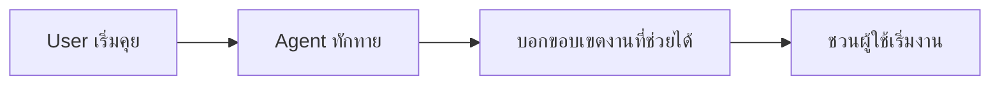
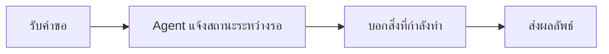
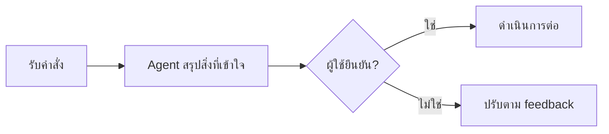
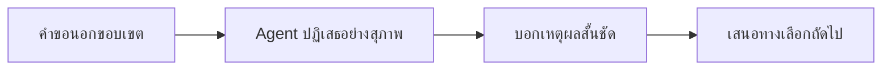

# Exercise 1: Conversation UX Tuning for Better Agent Experience

ในแบบฝึกหัดนี้ เราจะปรับบทสนทนาของ Agent ให้ใช้งานจริงได้ลื่นขึ้น 
โฟกัสหลักอยู่ที่ 4 ช่วงสำคัญของการคุยกับผู้ใช้: Greeting, Waiting, Confirmation และ Say No

🔑 **ต้องการ Copilot Studio License** และ Agent project ของทีมที่สร้างไว้แล้วจาก Module ก่อนหน้า

🔧 **เครื่องมือที่ใช้ในห้องเรียน:** Post-it อย่างน้อย 2 สี (หรือ Whiteboard sticky note template) เพื่อแยกข้อความเดิม (Before) และข้อความที่ปรับแล้ว (After)

> **⚠️ Note:** แบบฝึกหัดนี้เน้นการปรับข้อความและสไตล์การสนทนา ไม่ได้เพิ่ม Tool หรือเชื่อมระบบใหม่

---

## Goal

เมื่อจบแบบฝึกหัดนี้ ผู้เรียนจะสามารถ:

1. ออกแบบน้ำเสียงและข้อความของ Agent ให้สอดคล้องกันทั้ง 4 ช่วงการสนทนา
2. ลดความสับสนของผู้ใช้ระหว่าง Agent กำลังคิด, กำลังยืนยัน, และกรณีที่ตอบไม่ได้
3. สร้างมาตรฐานข้อความที่นำไปใช้ซ้ำได้ในหลาย feature ของ Agent เดียวกัน

---

## Practice 1: Greeting — เริ่มบทสนทนาให้มั่นใจ

### Greeting คืออะไร?

Greeting คือช่วงแรกที่ Agent ทักทายและตั้งความคาดหวังให้ผู้ใช้รู้ว่า Agent ช่วยอะไรได้บ้าง



**ตัวอย่าง ✅ ดี:**
- "สวัสดีครับ ผมช่วยสรุปรายงานการเงิน, อธิบายตัวเลขสำคัญ และเตรียม draft สำหรับส่งผู้บริหารได้ครับ"
- "ถ้าต้องการเริ่มเร็ว ลองพิมพ์: สรุปภาพรวมไตรมาสล่าสุด"

**ตัวอย่าง ⚠️ ควรปรับ:**
- "สวัสดี มีอะไรให้ช่วย" (กว้างเกินไป ไม่ชัดว่าเก่งเรื่องอะไร)
- "ผมช่วยได้ทุกอย่าง" (สร้างความคาดหวังเกินจริง)

### ให้ทีมออกแบบ Greeting สำหรับ Agent ของตัวเอง

ลองออกไอเดียคิดข้อความสำหรับอย่างน้อย 2 งานหลักของ Agent:

1. เขียน Greeting ลง Post-it 
2. แปะ Post-it เป็นคู่เพื่อเทียบความชัดเจนและน้ำเสียง

```
Feature/Task 1: ______________________
Greeting message:
```
```
Feature/Task 2: ______________________
Greeting message:
``` 
```
หลักการที่ทีมเลือกใช้ (เช่น สุภาพกระชับ, professional, friendly):
- 
- 
```

> **💡 Tip:** เปิดด้วยสิ่งที่ Agent ทำได้จริง 2-3 อย่าง จะช่วยให้ผู้ใช้เริ่มใช้งานได้เร็วกว่า opening ที่กว้างเกินไป

---

## Practice 2: Waiting — ระหว่างรอ ต้องไม่เงียบ

### Waiting คืออะไร?

Waiting คือช่วงที่ Agent กำลังประมวลผลข้อมูลหรือเรียกขั้นตอนต่อเนื่อง ผู้ใช้ควรรู้ว่า "ระบบยังทำงานอยู่"



**ตัวอย่าง ✅ ดี:**
- "กำลังดึงข้อมูลยอดขาย 3 เดือนล่าสุดให้นะครับ ใช้เวลาประมาณ 10-20 วินาที"
- "ตอนนี้กำลังตรวจสอบข้อมูลจากไฟล์และสรุปให้เป็น bullet points"

**ตัวอย่าง ⚠️ ควรปรับ:**
- "..." (ไม่มีข้อความระหว่างรอ)
- "รอสักครู่" (สั้นเกินไป ไม่บอกว่ากำลังทำอะไร)

### ให้ทีมออกแบบ Waiting Messages

เลือก 2 feature ที่มักใช้เวลาประมวลผล แล้วร่างข้อความรอ:

1. ใช้ Post-it สีที่ 1 เขียนข้อความรอที่บอกทั้งสถานะและสิ่งที่กำลังทำ
2. ให้เพื่อนร่วมทีมอ่าน Post-it โดยไม่ดูบริบท แล้วตรวจว่าข้อความเข้าใจได้ทันทีหรือไม่

```
Feature/Task 1: ______________________

สิ่งที่ Agent กำลังทำ (ผู้ใช้ควรรู้):
```
```
Feature/Task 2: ______________________

สิ่งที่ Agent กำลังทำ (ผู้ใช้ควรรู้):
```

> **💡 Tip:** ข้อความรอที่ดีควรบอกทั้ง "กำลังทำอะไร" และ "คาดการณ์เวลาโดยประมาณ" ถ้าทำได้

---

## Practice 3: Confirmation — ยืนยันให้ตรงก่อนเดินต่อ

### Confirmation คืออะไร?

Confirmation คือช่วงที่ Agent สะท้อนความเข้าใจกลับไปหาผู้ใช้ก่อน execute งานสำคัญ ลดโอกาสพลาดจากการตีความผิด



**ตัวอย่าง ✅ ดี:**
- "เพื่อยืนยันนะครับ: ต้องการสรุปรายงานไตรมาส 2 สำหรับทีมบริหารในรูปแบบ bullet 5 ข้อ ใช่ไหมครับ?"
- "ผมเข้าใจว่าต้องการเปรียบเทียบผลประกอบการ Q1 กับ Q2 ก่อนส่งเมล ถูกต้องไหมครับ"

**ตัวอย่าง ⚠️ ควรปรับ:**
- ไม่ยืนยันแล้วดำเนินการทันทีในงานที่มีหลายเงื่อนไข
- ยืนยันยาวเกินไปจนผู้ใช้อ่านยาก

### ให้ทีมออกแบบ Confirmation Pattern

สร้าง template ยืนยัน 2 แบบสำหรับงานของทีม:

1. เขียนรูปแบบยืนยันลง Post-it 1 ใบต่อ 1 use case
2. จัดกลุ่ม Post-it ตามจุดเสี่ยงที่ต้องยืนยัน เช่น เวลา, หน่วยงาน, รูปแบบ output

```
Use case 1: ______________________
Confirmation message:

ข้อมูลที่ต้องยืนยันก่อนทำงาน:
- 
- 
```
```
Use case 2: ______________________
Confirmation message:

ข้อมูลที่ต้องยืนยันก่อนทำงาน:
- 
- 
```

> **💡 Tip:** ยืนยันเฉพาะจุดเสี่ยงพลาด เช่น ช่วงเวลา, หน่วยงาน, รูปแบบ output และผู้รับผลลัพธ์

---

## Practice 4: Say No — ปฏิเสธอย่างมืออาชีพและพาไปทางออก

### Say No คืออะไร?

Say No คือวิธีที่ Agent ปฏิเสธคำขอที่อยู่นอกขอบเขต โดยยังช่วยพาผู้ใช้ไปยังทางเลือกที่ทำต่อได้



**ตัวอย่าง ✅ ดี:**
- "ขอโทษครับ ผมยังไม่สามารถอนุมัติรายการแทนผู้จัดการได้ แต่ผมช่วยสรุปข้อมูลเพื่อส่งอนุมัติให้ทันทีได้ครับ"
- "ตอนนี้ผมเข้าถึงได้เฉพาะข้อมูลภายในทีมการเงิน หากต้องการข้อมูล HR ผมช่วยร่างคำขอส่งต่อให้ได้"

**ตัวอย่าง ⚠️ ควรปรับ:**
- "ทำไม่ได้" (ไม่มีเหตุผลและไม่มีทางเลือก)
- "ไม่รู้" (ไม่ช่วยพา user ไปต่อ)

### ให้ทีมออกแบบ Say No + Redirect

เลือกอย่างน้อย 2 กรณีที่ Agent ควรปฏิเสธ แล้วออกแบบคำตอบ:

1. ใช้ Post-it สีที่ 1 สำหรับคำขอที่ควรปฏิเสธ (Out-of-scope)
2. ใช้ Post-it สีที่ 2 สำหรับข้อความ Say No + Redirect ที่ออกแบบใหม่
3. ติดเป็นคู่บนบอร์ดเพื่อเช็กว่า "ปฏิเสธ + พาไปต่อ" ครบทุกกรณี

```
Out-of-scope request 1: ______________________
```
```
Say No response:

Redirect option ที่เสนอ:
```


> **⚠️ Note:** Say No ที่ดีต้องไม่กระทบความมั่นใจของผู้ใช้ และต้องไม่เปิดขอบเขตเกิน capability จริงของ Agent


---

## Summary

คุณได้ฝึกปรับประสบการณ์บทสนทนาของ Agent ใน 4 ช่วงสำคัญ: Greeting, Waiting, Confirmation และ Say No
ผลลัพธ์ที่ได้คือชุดข้อความมาตรฐานที่ช่วยให้ Agent ใช้งานง่ายขึ้น น่าเชื่อถือขึ้น และพร้อมสำหรับการนำเสนอ Final Project

**Next Step:** กลับไปที่ [Module 6 Overview](../README.md) เพื่อเตรียม Demo flow สำหรับวันนำเสนอ
