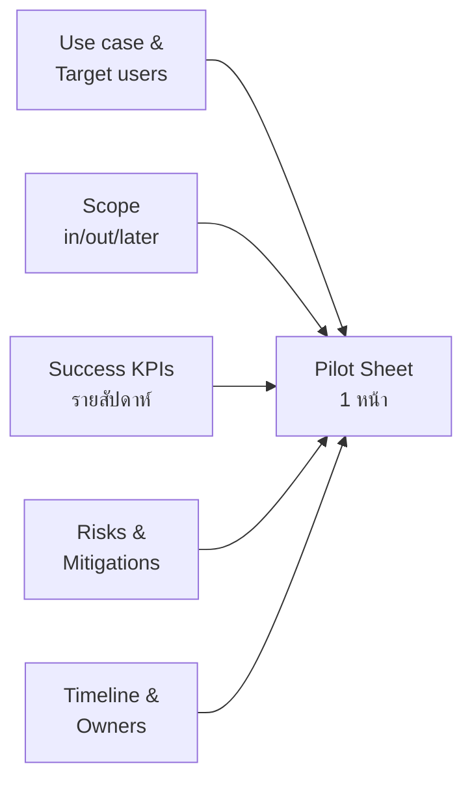
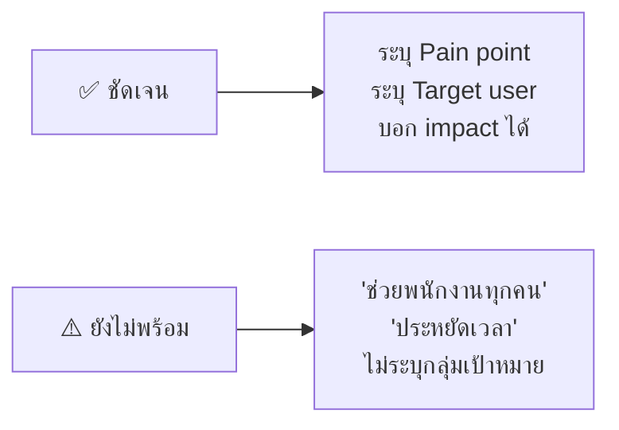
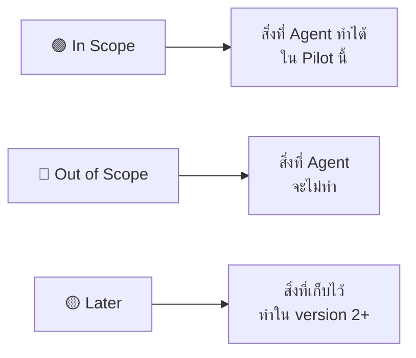
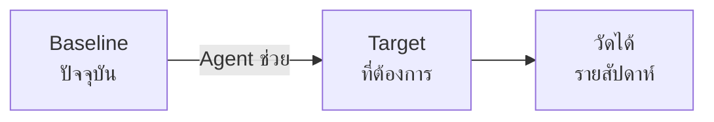
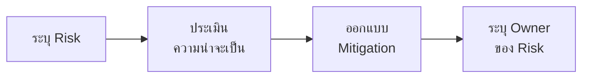
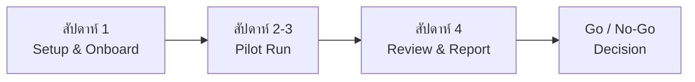

# Exercise 2: เขียน AI Pilot Sheet สำหรับผู้บริหาร

Pilot Sheet คือเอกสาร 1 หน้าที่ผู้บริหารหรือ Sponsor อ่านจบใน 2 นาทีแล้วตัดสินใจได้ทันที
แบบฝึกหัดนี้จะพาทีมร่าง Pilot Sheet จาก AI Agent project ที่สร้างมาตลอด bootcamp

> **⚠️ Note:** แบบฝึกหัดนี้ไม่ต้องใช้ Copilot Studio — ใช้เพียง Post-it, กระดาน หรือ Word/Notion ในการร่างและรวมเนื้อหาก็เพียงพอ

🔧 **เครื่องมือที่ใช้ในห้องเรียน:** Post-it อย่างน้อย 3 สี เพื่อแยก Use case (สีเหลือง), Scope (สีเขียว/แดง/ส้ม) และ Risk (สีแดง/สีม่วง)

---

## Goal

เมื่อจบแบบฝึกหัดนี้ ทีมจะมี Pilot Sheet ที่พร้อมนำเสนอต่อผู้บริหารหรือ Sponsor โดยครบ 5 ส่วนสำคัญ:



---

## Practice 1: Use case & Target users

### Use case & Target users คืออะไร?

ส่วนนี้ตอบคำถาม: **Agent นี้แก้ปัญหาอะไร และใครได้ประโยชน์?**
ผู้บริหารต้องการเห็นปัญหาที่ชัดเจนและกลุ่มผู้ใช้ที่จับต้องได้ ไม่ใช่แค่ชื่อ feature



**ตัวอย่าง ✅ ดี:**
- "HR Officer ใช้เวลา 30 นาทีต่อวันตอบคำถาม policy ซ้ำ ๆ — Agent จะลดเหลือ < 5 นาที"
- "Finance analyst ทุกคนในทีม 8 คน ต้องรอ IT pull รายงาน 2 วัน — Agent ทำได้ทันที"

**ตัวอย่าง ⚠️ ควรปรับ:**
- "Agent ช่วยพนักงาน SET ทุกคนในเรื่อง HR และการเงิน" (กว้างเกินไป)
- "ประหยัดเวลา" (ไม่มีตัวเลข ไม่มี target user ชัดเจน)

### ให้ทีมร่าง Use case & Target users

1. ใช้ Post-it สีเหลือง 1 ใบ เขียน Pain point หลัก 1 ข้อในประโยคเดียว
2. ใช้ Post-it สีเหลืองอีกใบ เขียนชื่อ Target user + จำนวนคนที่ได้ประโยชน์
3. แปะคู่กันบนกระดาน แล้วกรอกลงในแบบฝึกหัด

```
Use case:
[ปัญหา/งานที่ Agent ช่วยได้]:

Target users:
[กลุ่มผู้ใช้หลัก]:
[จำนวน / หน่วยงาน]:

Impact ที่คาดหวัง (1-2 ประโยค):
```

> **💡 Tip:** เขียน Use case ให้ผู้บริหารสายการเงินอ่านแล้วเข้าใจทันที — หลีกเลี่ยงคำเทคนิค เช่น "RAG", "Topic", "Copilot Studio"

---

## Practice 2: Scope — In / Out / Later

### Scope คืออะไร?

ส่วนนี้กำหนดขอบเขตของ Pilot ว่าอะไรทำใน Pilot นี้ อะไรไม่ทำ และอะไรเก็บไว้ทำรอบถัดไป
Sponsor จะใช้ข้อมูลนี้ตัดสินว่า Pilot นี้ manage ได้จริงหรือเปล่า



**ตัวอย่าง ✅ ดี:**
| In | Out | Later |
|---|---|---|
| ตอบคำถาม Policy ภาษาไทย | อนุมัติรายการแทนผู้จัดการ | เชื่อมกับ SAP |
| สรุป report ไตรมาสล่าสุด | เข้าถึงข้อมูล HR ส่วนตัว | รองรับหลายภาษา |

**ตัวอย่าง ⚠️ ควรปรับ:**
- ไม่มีส่วน Out หรือ Later เลย (ทำให้ Sponsor กังวลเรื่อง scope creep)
- ใส่ทุกอย่างใน In (ไม่สมจริง ทำให้ Pilot ล้มเหลวได้ง่าย)

### ให้ทีมจัด Scope ด้วย Post-it

> **💡 Tip:** ดูกลับไปที่ AI Agent Canvas จาก Module 2 เพื่อเช็ก use case boundary ที่เคยออกแบบไว้ก่อนจัด scope ใหม่

1. ใช้ Post-it **สีเขียว** สำหรับสิ่งที่อยู่ใน Pilot (In)
2. ใช้ Post-it **สีแดง** สำหรับสิ่งที่ไม่ทำ (Out)
3. ใช้ Post-it **สีส้ม/เหลือง** สำหรับสิ่งที่เก็บไว้ทำทีหลัง (Later)
4. จัดเป็น 3 กลุ่มบนกระดาน แล้วถ่ายรูปหรือกรอกลงในตาราง

```
| In Scope (ทำใน Pilot) | Out of Scope (ไม่ทำ) | Later (Version 2+) |
|---|---|---|
|  |  |  |
|  |  |  |
|  |  |  |
```

---

## Practice 3: Success KPIs (รายสัปดาห์)

### Success KPIs คืออะไร?

KPI ใน Pilot Sheet ต้องวัดได้รายสัปดาห์ มี baseline เปรียบเทียบ และผูกกับ Impact จาก Practice 1



**ตัวอย่าง ✅ ดี:**
| KPI | Baseline | Target (สัปดาห์ที่ 4) |
|---|---|---|
| เวลาตอบคำถาม Policy | 30 นาที/ครั้ง | < 5 นาที/ครั้ง |
| % คำถามที่ตอบได้โดยไม่ escalate | 40% | > 70% |
| จำนวนผู้ใช้ที่ใช้งาน Agent | 0 | ≥ 5 คน/สัปดาห์ |

**ตัวอย่าง ⚠️ ควรปรับ:**
- "ผู้ใช้พึงพอใจมากขึ้น" (ไม่มีตัวเลข ไม่วัดได้)
- "Agent ดีขึ้น" (ไม่มี baseline ไม่มีเส้น target)

### ให้ทีมร่าง KPIs

1. ใช้ Post-it 1 ใบต่อ 1 KPI (เขียน Metric + Baseline + Target)
2. เรียง Post-it ตามลำดับความสำคัญ (สำคัญสุด = บนสุด)
3. เลือก 2-3 KPI แรกมาใส่ใน Pilot Sheet

```
| KPI | Baseline ปัจจุบัน | Target (สัปดาห์ที่ 4) | วัดด้วยวิธีใด |
|---|---|---|---|
|  |  |  |  |
|  |  |  |  |
|  |  |  |  |
```

> **💡 Tip:** KPI ที่ดีสำหรับ Pilot มักจะเป็น "ความเร็ว", "อัตราความสำเร็จ", หรือ "การใช้งานจริง" — ไม่ใช่ "ความพึงพอใจ" ในรอบแรก

---

## Practice 4: Risks & Mitigations

### Risks & Mitigations คืออะไร?

Sponsor อยากรู้ว่าทีมมองเห็น "สิ่งที่อาจผิดพลาด" และมีแผนรับมือ ไม่ใช่แค่บอกว่า "ไม่มีปัญหา"



**ตัวอย่าง ✅ ดี:**
| Risk | ระดับ | Mitigation |
|---|---|---|
| ข้อมูล Policy ไม่ครบ | สูง | เตรียม FAQ 50 ข้อ + ทบทวนทุก 2 สัปดาห์ |
| ผู้ใช้ไม่ adopt | กลาง | ทำ demo ให้ HR team ก่อน launch |
| Agent ตอบผิดเรื่อง sensitive data | สูง | ตั้ง guardrail และ escalation ไว้ก่อน |

**ตัวอย่าง ⚠️ ควรปรับ:**
- ไม่มี Risk เลย (ทำให้ Sponsor ไม่เชื่อใจ)
- มี Risk แต่ไม่มี Mitigation (ทำให้ดูไม่ได้เตรียมพร้อม)

### ให้ทีมระบุ Risks & Mitigations

1. ใช้ Post-it **สีแดง** เขียน Risk แต่ละข้อ (1 ใบ = 1 Risk)
2. ใช้ Post-it **สีม่วงหรือน้ำเงิน** เขียน Mitigation คู่กัน
3. แปะ Risk-Mitigation เป็นคู่ แล้วจัดกลุ่มตามระดับความเสี่ยง

```
| Risk | ระดับ (สูง/กลาง/ต่ำ) | Mitigation | Owner |
|---|---|---|---|
|  |  |  |  |
|  |  |  |  |
|  |  |  |  |
```

> **⚠️ Note:** อย่าเขียน Risk มากกว่า 5 ข้อ — เลือกเฉพาะสิ่งที่มีผลต่อการตัดสินใจของ Sponsor

---

## Practice 5: Timeline & Owners

### Timeline & Owners คืออะไร?

ส่วนนี้บอก Sponsor ว่า Pilot จะใช้เวลากี่สัปดาห์ แต่ละช่วงทำอะไร และใครรับผิดชอบ



**ตัวอย่าง ✅ ดี:**
| ช่วงเวลา | Milestone | Owner |
|---|---|---|
| สัปดาห์ 1 | Deploy Agent + train HR team 5 คน | ชื่อ_A |
| สัปดาห์ 2-3 | Run Pilot + เก็บ KPI รายวัน | ชื่อ_B |
| สัปดาห์ 4 | สรุปผล + เตรียม Go/No-Go report | ชื่อ_A + ชื่อ_C |

**ตัวอย่าง ⚠️ ควรปรับ:**
- "ใช้เวลาประมาณ 1 เดือน" (ไม่มี milestone ไม่มี owner)
- ไม่ระบุชื่อคน เฉพาะชื่อทีม (ทำให้ไม่รู้ว่าใครรับผิดชอบจริง)

### ให้ทีมวาง Timeline บน Post-it

1. วาดเส้น Timeline บนกระดาน (4-6 สัปดาห์)
2. ใช้ Post-it 1 ใบต่อ Milestone แปะตำแหน่งบนเส้น
3. เขียนชื่อ Owner ลงมุมล่างของ Post-it แต่ละใบ

```
| ช่วงเวลา | Milestone หลัก | Owner |
|---|---|---|
| สัปดาห์ 1 |  |  |
| สัปดาห์ 2-3 |  |  |
| สัปดาห์ 4 |  |  |
| หลัง Pilot |  |  |
```

---

## Practice 6: รวมเป็น Pilot Sheet 1 หน้า

นำเนื้อหาจาก Practice 1-5 มาเรียบเรียงในรูปแบบ Pilot Sheet สำเร็จรูปด้านล่าง
เป้าหมายคือผู้บริหารอ่านจบใน **2 นาที** และตัดสินใจได้ทันที

> **💡 Tip:** ถ้า Pilot Sheet พิมพ์แล้วเกิน 1 หน้า A4 — ให้ตัดข้อมูลที่ไม่ใช่ "ข้อมูลตัดสินใจ" ออก แล้วย้ายไปใส่ annexe แทน

```
=============================================================
AI PILOT SHEET
=============================================================

ชื่อ Agent:
ทีม / หน่วยงาน:
วันที่จัดทำ:

-------------------------------------------------------------
1. USE CASE & TARGET USERS
-------------------------------------------------------------
ปัญหาที่แก้:

Target users:

Impact ที่คาดหวัง:

-------------------------------------------------------------
2. SCOPE
-------------------------------------------------------------
IN (ทำใน Pilot):
- 
- 

OUT (ไม่ทำ):
- 
- 

LATER (Version 2+):
- 

-------------------------------------------------------------
3. SUCCESS KPIs (รายสัปดาห์)
-------------------------------------------------------------
| KPI | Baseline | Target (สัปดาห์ 4) |
|-----|----------|---------------------|
|     |          |                     |
|     |          |                     |

-------------------------------------------------------------
4. RISKS & MITIGATIONS
-------------------------------------------------------------
| Risk (Top 3) | ระดับ | Mitigation |
|--------------|-------|------------|
|              |       |            |
|              |       |            |

-------------------------------------------------------------
5. TIMELINE & OWNERS
-------------------------------------------------------------
| ช่วงเวลา | Milestone | Owner |
|----------|-----------|-------|
| สัปดาห์ 1 |           |       |
| สัปดาห์ 2-3 |         |       |
| สัปดาห์ 4 |           |       |

=============================================================
Go / No-Go Decision: __________  วันที่: __________
Sponsor Signature: _______________________________
=============================================================
```

---

## Summary

ทีมมี Pilot Sheet ครบ 5 ส่วน ที่พร้อมนำเสนอต่อผู้บริหารหรือ Sponsor
เอกสารนี้สรุปสิ่งที่ทีมทำมาตลอด bootcamp ให้อยู่ในรูปแบบที่ตัดสินใจได้จริงในระดับองค์กร

**Next Step:** กลับไปที่ [Module 6 Overview](../README.md) เพื่อเตรียมเดโมและนำเสนอ Final Project
